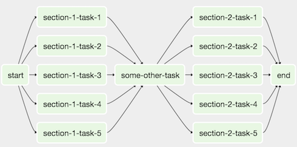
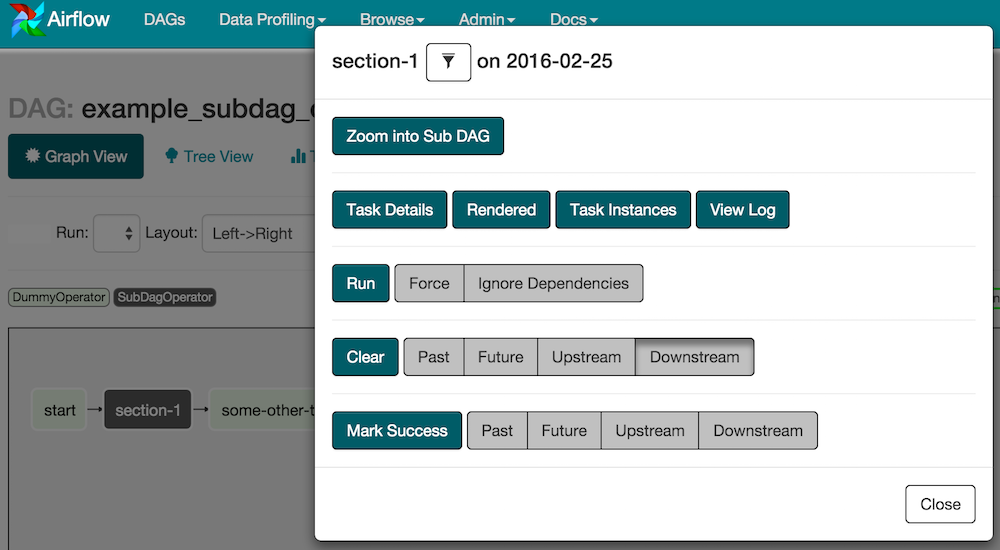
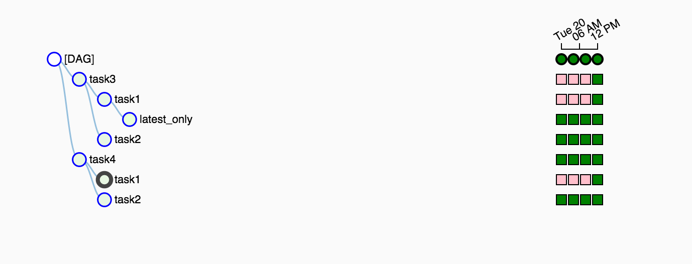

# 概念

> 贡献者：[@ImPerat0R\_](https://github.com/tssujt) [@zhongjiajie](https://github.com/zhongjiajie)

Airflow Platform 是用于描述，执行和监控工作流的工具。

## 核心理念

### DAGs

在 Airflow 中，`DAG`（或者叫有向无环图）是您要运行的所有任务的集合，以反映其关系和依赖关系的方式进行组织。

例如，一个简单的 DAG 可以包含三个任务：A，B 和 C.可以说 A 必须在 B 可以运行之前成功运行，但 C 可以随时运行。它可以说任务 A 在 5 分钟后超时，并且 B 可以重新启动最多 5 次以防它失败。它也可能会说工作流程将在每天晚上 10 点运行，但不应该在某个特定日期之前开始。

通过这种方式，DAG 描述了您希望如何执行工作流程; 但请注意，我们还没有说过我们真正想做的事情！A，B 和 C 可以是任何东西。当 C 发送电子邮件时，也许 A 准备 B 进行分析的数据。或者也许 A 监控你的位置，这样 B 可以打开你的车库门，而 C 打开你的房子灯。 重要的是，DAG 并不关心其组成任务的作用;它的工作是确保无论他们做什么在正确的时间，或正确的顺序，或正确处理任何意外的问题。

DAG 是在标准 Python 文件中定义的，这些文件放在 Airflow 的`DAG_FOLDER`中。Airflow 将执行每个文件中的代码以动态构建`DAG`对象。 您可以拥有任意数量的 DAG，每个 DAG 都可以描述任意数量的任务。通常，每个应该对应于单个逻辑工作流。

> 注意
>
> 搜索 DAG 时，Airflow 将仅考虑字符串“airflow”和“DAG”都出现在`.py`文件内容中的文件。

#### 范围

Airflow 将加载它可以从`DAG`文件导入的任何`DAG`对象。重要的是，这意味着 DAG 必须出现在`globals()`。考虑以下两个 DAG。只会加载`dag_1` ; 另一个只出现在本地范围内。

```py
dag_1 = DAG('this_dag_will_be_discovered')

def my_function():
    dag_2 = DAG('but_this_dag_will_not')

my_function()
```

有时这可以很好地利用。例如，`SubDagOperator`的常见模式是定义函数内的子标记，以便 Airflow 不会尝试将其作为独立的 DAG 加载。

#### 默认参数

如果将`default_args`字典传递给 DAG，它将把它们应用于任何运算符。这使得很容易将公共参数应用于许多运算符而无需多次键入。

```py
default_args = {
    'start_date': datetime(2016, 1, 1),
    'owner': 'Airflow'
}

dag = DAG('my_dag', default_args=default_args)
op = DummyOperator(task_id='dummy', dag=dag)
print(op.owner) # Airflow
```

#### 上下文管理器

_ 在 Airflow 1.8 中添加 _

DAG 可用作上下文管理器，以自动将新 Operator 分配给该 DAG。

```py
with DAG('my_dag', start_date=datetime(2016, 1, 1)) as dag:
    op = DummyOperator('op')

op.dag is dag # True
```

### 运营商

虽然 DAG 描述了如何运行工作流，但`Operators`确定实际完成的工作。

Operator 描述工作流中的单个任务。Operator 通常（但并非总是）是原子的，这意味着他们可以独立运营，而不需要与任何其他 Operator 共享资源。DAG 将确保 Operator 以正确的顺序运行; 除了这些依赖项之外， Operator 通常独立运行。实际上，它们可以在两台完全不同的机器上运行。

这是一个微妙但非常重要的一点：通常，如果两个 Operator 需要共享信息，如文件名或少量数据，您应该考虑将它们组合到一个 Operator 中。如果绝对无法避免，Airflow 确实具有操作员交叉通信的功能，称为 XCom，本文档的其他部分对此进行了描述。

Airflow 为许多常见任务提供 Operator ，包括：

* `BashOperator` - 执行 bash 命令
* `PythonOperator` - 调用任意 Python 函数
* `EmailOperator` - 发送电子邮件
* `SimpleHttpOperator` - 发送 HTTP 请求
* `MySqlOperator`，`SqliteOperator`，`PostgresOperator`，`MsSqlOperator`，`OracleOperator`，`JdbcOperator`等 - 执行 SQL 命令
* `Sensor` - 等待一定时间，文件，数据库行，S3 键等...

除了这些基本构建块之外，还有许多特定的 Operator ： `DockerOperator`，`HiveOperator`，`S3FileTransformOperator`，`PrestoToMysqlOperator`，`SlackOperator`......你会明白的！

`airflow/contrib/`目录包含更多由社区构建的 Operator 。这些运算符并不总是像主发行版中那样完整或经过良好测试，但允许用户更轻松地向平台添加新功能。

如果将 Operator 分配给 DAG，则 Operator 仅由 Airflow 加载。

请参阅[使用Operators](zh/howto/operator.md)了解如何使用 Airflow Operator 。

#### DAG 分配

_ 在 Airflow 1.8 中添加 _

 Operator 不必立即分配给 DAG（之前的`dag`是必需参数）。但是，一旦将 Operator 分配给 DAG，就无法转移或取消分配。在创建运算符时，通过延迟赋值或甚至从其他运算符推断，可以显式地完成 DAG 分配。

```py
dag = DAG('my_dag', start_date=datetime(2016, 1, 1))

# sets the DAG explicitly
explicit_op = DummyOperator(task_id='op1', dag=dag)

# deferred DAG assignment
deferred_op = DummyOperator(task_id='op2')
deferred_op.dag = dag

# inferred DAG assignment (linked operators must be in the same DAG)
inferred_op = DummyOperator(task_id='op3')
inferred_op.set_upstream(deferred_op)
```

#### 位运算符

_ 在 Airflow 1.8 中添加 _

传统上，使用`set_upstream()`和`set_downstream()`方法设置运算符关系。在 Airflow 1.8 中，这可以通过 Python 位运算符`>>`和`<<`来完成。以下四个语句在功能上都是等效的：

```py
op1 >> op2
op1.set_downstream(op2)

op2 << op1
op2.set_upstream(op1)
```

当使用位运算符时，关系设置在位运算符指向的方向上。例如，`op1 >> op2`表示`op1`先运行，`op2`第二运行。可以组成多个运算符 - 请记住，链从左到右执行，并且始终返回最右边的对象。 例如：

```py
op1 >> op2 >> op3 << op4
```

相当于：

```py
op1.set_downstream(op2)
op2.set_downstream(op3)
op3.set_upstream(op4)
```

为方便起见，位运算符也可以与 DAG 一起使用。 例如：

```py
dag >> op1 >> op2
```

相当于：

```py
op1.dag = dag
op1.set_downstream(op2)
```

我们可以把这一切放在一起构建一个简单的管道：

```py
with DAG('my_dag', start_date=datetime(2016, 1, 1)) as dag:
    (
        DummyOperator(task_id='dummy_1')
        >> BashOperator(
            task_id='bash_1',
            bash_command='echo "HELLO!"')
        >> PythonOperator(
            task_id='python_1',
            python_callable=lambda: print("GOODBYE!"))
    )
```

### 任务

一旦 Operator 被实例化，它就被称为“任务”。实例化在调用抽象 Operator 时定义特定值，参数化任务成为 DAG 中的节点。

### 任务实例

任务实例表示任务的特定运行，其特征在于 dag，任务和时间点的组合。 任务实例也有一个指示状态，可以是“运行”，“成功”，“失败”，“跳过”，“重试”等。

### 工作流程

您现在熟悉 Airflow 的核心构建模块。 有些概念可能听起来非常相似，但词汇表可以概念化如下：

* DAG：描述工作应该发生的顺序
* Operator：作为执行某些工作的模板的类
* 任务： Operator 参数化实例
* 任务实例：1）已分配给 DAG 的任务，2）具有与 DAG 的特定运行相关联的状态

通过组合`DAGs`和`Operators`来创建`TaskInstances`，您可以构建复杂的工作流。

## 附加功能

除了核心 Airflow 对象之外，还有许多更复杂的功能可以实现限制同时访问资源，交叉通信，条件执行等行为。

### 钩

钩子是外部平台和数据库的接口，如 Hive，S3，MySQL，Postgres，HDFS 和 Pig。Hooks 尽可能实现通用接口，并充当 Operator 的构建块。他们还使用`airflow.models.Connection`模型来检索主机名和身份验证信息。钩子将身份验证代码和信息保存在管道之外，集中在元数据数据库中。

钩子在 Python 脚本，Airflow airflow.operators.PythonOperator 以及 iPython 或 Jupyter Notebook 等交互式环境中使用它们也非常有用。

### 池

当有太多进程同时运行时，某些系统可能会被淹没。Airflow 池可用于**限制**任意任务集上**的执行并行性** 。通过为池命名并为其分配多个工作槽来在 UI（ `Menu -> Admin -> Pools` ）中管理池列表。然后，在创建任务时（即，实例化运算符），可以使用`pool`参数将任务与其中一个现有池相关联。

```py
aggregate_db_message_job = BashOperator(
    task_id='aggregate_db_message_job',
    execution_timeout=timedelta(hours=3),
    pool='ep_data_pipeline_db_msg_agg',
    bash_command=aggregate_db_message_job_cmd,
    dag=dag)
aggregate_db_message_job.set_upstream(wait_for_empty_queue)
```

`pool`参数可以与`priority_weight`结合使用，以定义队列中的优先级，以及在池中打开的槽时首先执行哪些任务。默认的`priority_weight`是`1`，可以碰到任何数字。 在对队列进行排序以评估接下来应该执行哪个任务时，我们使用`priority_weight`与来自此任务下游任务的所有`priority_weight`值相加。您可以使用它来执行特定的重要任务，并相应地优先处理该任务的整个路径。

当插槽填满时，任务将照常安排。达到容量后，可运行的任务将排队，其状态将在 UI 中显示。当插槽空闲时，排队的任务将根据`priority_weight` （任务及其后代）开始运行。

请注意，默认情况下，任务不会分配给任何池，并且它们的执行并行性仅限于执行程序的设置。

### 连接

外部系统的连接信息存储在 Airflow 元数据数据库中，并在 UI 中进行管理（`Menu -> Admin -> Connections`）。在那里定义了`conn_id` ，并附加了主机名/登录/密码/结构信息。 Airflow 管道可以简单地引用集中管理的`conn_id`而无需在任何地方硬编码任何此类信息。

可以定义具有相同`conn_id`许多连接，并且在这种情况下，并且当**挂钩**使用来自`BaseHook`的`get_connection`方法时，Airflow 将随机选择一个连接，允许在与重试一起使用时进行一些基本的负载平衡和容错。

Airflow 还能够通过操作系统中的环境变量引用连接。但它只支持 URI 格式。如果您需要为连接指定`extra`信息，请使用 Web UI。

如果在 Airflow 元数据数据库和环境变量中都定义了具有相同`conn_id`连接，则 Airflow 将仅引用环境变量中的连接（例如，给定`conn_id` `postgres_master`，在开始搜索元数据数据库之前，Airflow 将优先在环境变量中搜索`AIRFLOW_CONN_POSTGRES_MASTER`并直接引用它）。

许多钩子都有一个默认的`conn_id`，使用该挂钩的 Operator 不需要提供显式连接 ID。 例如，[`PostgresHook`](zh/code.md)的默认`conn_id`是`postgres_default` 。

请参阅[管理连接](zh/howto/manage-connections.md)以了解如何创建和管理连接。

### 队列

使用 CeleryExecutor 时，可以指定发送任务到 Celery 队列。`queue`是 BaseOperator 的一个属性，因此任何任务都可以分配给任何队列。 环境的默认队列配置在`airflow.cfg`的`celery -> default_queue`。这定义了未指定任务时分配给的队列，以及 Airflow 工作程序在启动时侦听的队列。

Workers 可以收听一个或多个任务队列。当工作程序启动时（使用命令`airflow worker`），可以指定一组逗号分隔的队列名称（例如， `airflow worker -q spark`）。然后，该 worker 将仅接收连接到指定队列的任务。

如果您需要特定的 workers，从资源角度来看（例如，一个工作人员可以毫无问题地执行数千个任务），或者从环境角度（您希望工作人员从 Spark 群集中运行），这可能非常有用本身，因为它需要一个非常具体的环境和安全的权利）。

### XComs

XComs 允许任务交换消息，允许更细微的控制形式和共享状态。该名称是“交叉通信”的缩写。XComs 主要由键，值和时间戳定义，但也跟踪创建 XCom 的任务/DAG 以及何时应该可见的属性。任何可以被 pickle 的对象都可以用作 XCom 值，因此用户应该确保使用适当大小的对象。

可以“推”（发送）或“拉”（接收）XComs。当任务推送 XCom 时，它通常可用于其他任务。任务可以通过调用`xcom_push()`方法随时推送 XComs。 此外，如果任务返回一个值（来自其 Operator 的`execute()`方法，或者来自 PythonOperator 的`python_callable`函数），则会自动推送包含该值的 XCom。

任务调用`xcom_pull()`来检索 XComs，可选地根据`key`，source `task_ids`和 source `dag_id`等条件应用过滤器。默认情况下， `xcom_pull()`过滤掉从执行函数返回时被自动赋予 XCom 的键（与手动推送的 XCom 相反）。

如果为`task_ids`传递`xcom_pull`单个字符串，则返回该任务的最新 XCom 值; 如果传递了 task_ids 列表，则返回相应的 XCom 值列表。

```py
# inside a PythonOperator called 'pushing_task'
def push_function():
    return value

# inside another PythonOperator where provide_context=True
def pull_function(**context):
    value = context['task_instance'].xcom_pull(task_ids='pushing_task')
```

也可以直接在模板中提取 XCom，这是一个示例：

```py
SELECT * FROM {{ task_instance.xcom_pull(task_ids='foo', key='table_name') }}
```

请注意，XCom 与[变量](zh/concepts.md)类似，但专门用于任务间通信而非全局设置。

### 变量

变量是将任意内容或设置存储和检索为 Airflow 中的简单键值存储的通用方法。可以从 UI（`Admin -> Variables`），代码或 CLI 列出，创建，更新和删除变量。此外，json 设置文件可以通过 UI 批量上传。虽然管道代码定义和大多数常量和变量应该在代码中定义并存储在源代码控制中，但是通过 UI 可以访问和修改某些变量或配置项会很有用。

```py
from airflow.models import Variable
foo = Variable.get("foo")
bar = Variable.get("bar", deserialize_json=True)
```

第二个调用假设`json`内容，并将反序列化为`bar`。请注意， `Variable`是 sqlalchemy 模型，可以这样使用。

您可以使用 jinja 模板中的变量，其语法如下：

```py
echo {{ var.value.<variable_name> }}
```

或者如果需要从变量反序列化 json 对象：

```py
echo {{ var.json.<variable_name> }}
```

### 分枝

有时您需要一个工作流来分支，或者只根据任意条件走下某条路径，这通常与上游任务中发生的事情有关。 一种方法是使用`BranchPythonOperator` 。

`BranchPythonOperator`与 PythonOperator 非常相似，只是它需要一个返回 task_id 的 python_callable。返回返回的 task_id，并跳过所有其他路径。Python 函数返回的 task_id 必须直接引用 BranchPythonOperator 任务下游的任务。

请注意，使用`depends_on_past=True`下游的任务在逻辑上是不合理的，因为`skipped`状态将总是导致依赖于过去成功的块任务。 `skipped`状态在所有直接上游任务被`skipped`地方传播。

如果你想跳过一些任务，请记住你不能有一个空路径，如果是这样，那就做一个虚拟任务。

像这样，跳过虚拟任务“branch_false”


不喜欢这样，跳过连接任务


### SubDAGs

SubDAG 非常适合重复模式。在使用 Airflow 时，定义一个返回 DAG 对象的函数是一个很好的设计模式。

Airbnb 在加载数据时使用阶段检查交换模式。数据在临时表中暂存，然后对该表执行数据质量检查。 一旦检查全部通过，分区就会移动到生产表中。

再举一个例子，考虑以下 DAG：



我们可以将所有并行`task-*`运算符组合到一个 SubDAG 中，以便生成的 DAG 类似于以下内容：


请注意，SubDAG 运算符应包含返回 DAG 对象的工厂方法。 这将阻止 SubDAG 在主 UI 中被视为单独的 DAG。 例如：

```py
#dags/subdag.py
from airflow.models import DAG
from airflow.operators.dummy_operator import DummyOperator


# Dag is returned by a factory method
def sub_dag(parent_dag_name, child_dag_name, start_date, schedule_interval):
  dag = DAG(
    '%s.%s' % (parent_dag_name, child_dag_name),
    schedule_interval=schedule_interval,
    start_date=start_date,
  )

  dummy_operator = DummyOperator(
    task_id='dummy_task',
    dag=dag,
  )

  return dag
```

然后可以在主 DAG 文件中引用此 SubDAG：

```py
# main_dag.py
from datetime import datetime, timedelta
from airflow.models import DAG
from airflow.operators.subdag_operator import SubDagOperator
from dags.subdag import sub_dag


PARENT_DAG_NAME = 'parent_dag'
CHILD_DAG_NAME = 'child_dag'

main_dag = DAG(
  dag_id=PARENT_DAG_NAME,
  schedule_interval=timedelta(hours=1),
  start_date=datetime(2016, 1, 1)
)

sub_dag = SubDagOperator(
  subdag=sub_dag(PARENT_DAG_NAME, CHILD_DAG_NAME, main_dag.start_date,
                 main_dag.schedule_interval),
  task_id=CHILD_DAG_NAME,
  dag=main_dag,
)
```

您可以从主 DAG 的图形视图放大 SubDagOperator，以显示 SubDAG 中包含的任务：



使用 SubDAG 时的一些其他提示：

* 按照惯例，SubDAG 的`dag_id`应以其父级和点为前缀。 和在`parent.child`
* 通过将参数传递给 SubDAG 运算符来共享主 DAG 和 SubDAG 之间的参数（如上所示）
* SubDAG 必须有一个计划并启用。如果 SubDAG 的时间表设置为`None`或`@once` ，SubDAG 将成功完成而不做任何事情
* 清除 SubDagOperator 也会清除其中的任务状态
* 在 SubDagOperator 上标记成功不会影响其中的任务状态
* 避免在任务中使用`depends_on_past=True`，因为这可能会造成混淆
* 可以为 SubDAG 指定执行程序。 如果要在进程中运行 SubDAG 并有效地将其并行性限制为 1，则通常使用 SequentialExecutor。使用 LocalExecutor 可能会有问题，因为它可能会过度消耗您的 workers，在单个插槽中运行多个任务

有关演示，请参阅`airflow/example_dags` 。

### SLAs

服务级别协议或者叫任务或 DAG 应该成功的时间，可以在任务级别设置为`timedelta`。如果此时一个或多个实例未成功，则会发送警报电子邮件，详细说明错过其 SLA 的任务列表。该事件也记录在数据库中，并在`Browse->Missed SLAs`下的 Web UI 中显示，其中可以分析和记录事件。

### 触发规则

虽然正常的工作流行为是在所有直接上游任务都成功时触发任务，但 Airflow 允许更复杂的依赖项设置。

所有运算符都有一个`trigger_rule`参数，该参数定义生成的任务被触发的规则。`trigger_rule`的默认值是`all_success`，可以定义为“当所有直接上游任务都成功时触发此任务”。此处描述的所有其他规则都基于直接父任务，并且是在创建任务时可以传递给任何操作员的值：

* `all_success` :(默认）所有父任务都成功了
* `all_failed` ：所有父`all_failed`都处于`failed`或`upstream_failed`状态
* `all_done` ：所有父任务都完成了他们的执行
* `one_failed` ：一旦至少一个父任务就会触发，它不会等待所有父任务完成
* `one_success` ：一旦至少一个父任务成功就触发，它不会等待所有父母完成
* `dummy` ：依赖项仅用于显示，随意触发

请注意，这些可以与`depends_on_past`（boolean）结合使用，当设置为`True`，如果任务的先前计划未成功，则不会触发任务。

### 只运行最新的

标准工作流行为涉及为特定日期/时间范围运行一系列任务。但是，某些工作流执行的任务与运行时无关，但需要按计划运行，就像标准的 cron 作业一样。在这些情况下，暂停期间错过的回填或运行作业会浪费 CPU 周期。

对于这种情况，您可以使用`LatestOnlyOperator`跳过在 DAG 的最近计划运行期间未运行的任务。如果现在的时间不在其`execution_time`和下一个计划的`execution_time`之间，则`LatestOnlyOperator`跳过所有直接下游任务及其自身。

必须意识到跳过的任务和触发器规则之间的相互作用。跳过的任务将通过触发器规则`all_success`和`all_failed`级联，但不是`all_done` ，`one_failed` ，`one_success`和`dummy`。如果您希望将`LatestOnlyOperator`与不级联跳过的触发器规则一起使用，则需要确保`LatestOnlyOperator`**直接**位于您要跳过的任务的上游。

通过使用触发器规则来混合应该在典型的日期/时间依赖模式下运行的任务和使用`LatestOnlyOperator`任务是可能的。

例如，考虑以下 dag：

```py
#dags/latest_only_with_trigger.py
import datetime as dt

from airflow.models import DAG
from airflow.operators.dummy_operator import DummyOperator
from airflow.operators.latest_only_operator import LatestOnlyOperator
from airflow.utils.trigger_rule import TriggerRule


dag = DAG(
    dag_id='latest_only_with_trigger',
    schedule_interval=dt.timedelta(hours=4),
    start_date=dt.datetime(2016, 9, 20),
)

latest_only = LatestOnlyOperator(task_id='latest_only', dag=dag)

task1 = DummyOperator(task_id='task1', dag=dag)
task1.set_upstream(latest_only)

task2 = DummyOperator(task_id='task2', dag=dag)

task3 = DummyOperator(task_id='task3', dag=dag)
task3.set_upstream([task1, task2])

task4 = DummyOperator(task_id='task4', dag=dag,
                      trigger_rule=TriggerRule.ALL_DONE)
task4.set_upstream([task1, task2])
```

在这个 dag 的情况下，对于除最新运行之外的所有运行，`latest_only`任务将显示为跳过。`task1`直接位于`latest_only`下游，并且除了最新的之外还将跳过所有运行。`task2`完全独立于`latest_only`，将在所有计划的时间段内运行。`task3`是`task1`和`task2`下游，由于默认的`trigger_rule`是`all_success`将从`all_success`接收级联跳过。`task4`是`task1`和`task2`下游，但由于其`trigger_rule`设置为`all_done`因此一旦跳过`all_done`（有效的完成状态）并且`task2`成功，它将立即触发。



### 僵尸与不死

任务实例一直在死，通常是正常生命周期的一部分，但有时会出乎人到意料。

僵尸任务的特点是没有心跳（由工作定期发出）和数据库中的`running`状态。当工作节点无法访问数据库，Airflow 进程在外部被终止或者节点重新启动时，它们可能会发生。僵尸任务查杀是由调度程序的进程定期执行。

不死进程的特点是存在进程和匹配的心跳，但 Airflow 不知道此任务在数据库中`running`。这种不匹配通常在数据库状态发生变化时发生，最有可能是通过删除 UI 中“任务实例”视图中的行。指示任务验证其作为心跳例程的一部分的状态，并在确定它们处于这种“不死”状态时终止自身。

### 集群策略

您的本地 Airflow 设置文件可以定义一个`policy`功能，该功能可以根据其他任务或 DAG 属性改变任务属性。它接收单个参数作为对任务对象的引用，并期望改变其属性。

例如，此函数可以在使用特定运算符时应用特定队列属性，或强制执行任务超时策略，确保没有任务运行超过 48 小时。 以下是`airflow_settings.py` ：

```py
def policy(task):
    if task.__class__.__name__ == 'HivePartitionSensor':
        task.queue = "sensor_queue"
    if task.timeout > timedelta(hours=48):
        task.timeout = timedelta(hours=48)
```

### 文档和注释

可以在 Web 界面中显示的 dag 和任务对象中添加文档或注释（dag 为“Graph View”，任务为“Task Details”）。如果定义了一组特殊任务属性，它们将被呈现为丰富内容：

| 属性 | 渲染到 |
| --- | --- |
| doc | monospace |
| doc_json | JSON |
| doc_yaml | YAML |
| doc_md | markdown |
| doc_rst | reStructuredText |

请注意，对于 dags，doc_md 是解释的唯一属性。

如果您的任务是从配置文件动态构建的，则此功能特别有用，它允许您公开 Airflow 中相关任务的配置。

```py
"""
### My great DAG
"""

dag = DAG('my_dag', default_args=default_args)
dag.doc_md = __doc__

t = BashOperator("foo", dag=dag)
t.doc_md = """\
#Title"
Here's a [url](www.airbnb.com)
"""
```

此内容将分别在“图表视图”和“任务详细信息”页面中呈现为 markdown。

### Jinja 模板

Airflow 充分利用了[Jinja Templating](http://jinja.pocoo.org/docs/dev/)的强大功能，这可以成为与宏结合使用的强大工具（参见[宏](zh/code.md)部分）。

例如，假设您希望使用`BashOperator`将执行日期作为环境变量传递给 Bash 脚本。

```py
# The execution date as YYYY-MM-DD
date = "{{ ds }}"
t = BashOperator(
    task_id='test_env',
    bash_command='/tmp/test.sh ',
    dag=dag,
    env={'EXECUTION_DATE': date})
```

这里， `{{ ds }}`是一个宏，并且由于`BashOperator`的`env`参数是使用 Jinja 模板化的，因此执行日期将作为 Bash 脚本中名为`EXECUTION_DATE`的环境变量提供。

您可以将 Jinja 模板与文档中标记为“模板化”的每个参数一起使用。模板替换发生在调用运算符的 pre_execute 函数之前。

## 打包的 dags

虽然通常会在单个`.py`文件中指定 dags，但有时可能需要将 dag 及其依赖项组合在一起。 例如，您可能希望将多个 dag 组合在一起以将它们一起版本，或者您可能希望将它们一起管理，或者您可能需要一个额外的模块，默认情况下在您运行 airflow 的系统上不可用。 为此，您可以创建一个 zip 文件，其中包含 zip 文件根目录中的 dag，并在目录中解压缩额外的模块。

例如，您可以创建一个如下所示的 zip 文件：

```py
my_dag1.py
my_dag2.py
package1/__init__.py
package1/functions.py
```

Airflow 将扫描 zip 文件并尝试加载`my_dag1.py`和`my_dag2.py` 。 它不会进入子目录，因为它们被认为是潜在的包。

如果您想将模块依赖项添加到 DAG，您基本上也可以这样做，但是更多的是使用 virtualenv 和 pip。

```py
virtualenv zip_dag
source zip_dag/bin/activate

mkdir zip_dag_contents
cd zip_dag_contents

pip install --install-option = "--install-lib= $PWD " my_useful_package
cp ~/my_dag.py .

zip -r zip_dag.zip *
```

> 注意
> 
> zip 文件将插入模块搜索列表（sys.path）的开头，因此它将可用于驻留在同一解释器中的任何其他代码。

> 注意
> 
> 打包的 dags 不能与打开 pickling 时一起使用。

> 注意
> 
> 打包的 dag 不能包含动态库（例如 libz.so），如果模块需要这些库，则需要在系统上使用这些库。换句话说，只能打包纯 python 模块。
