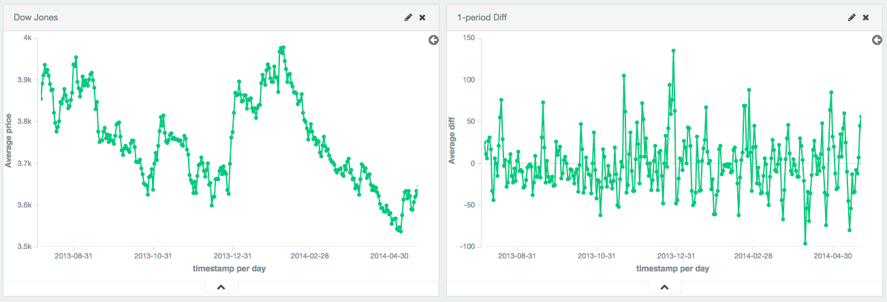
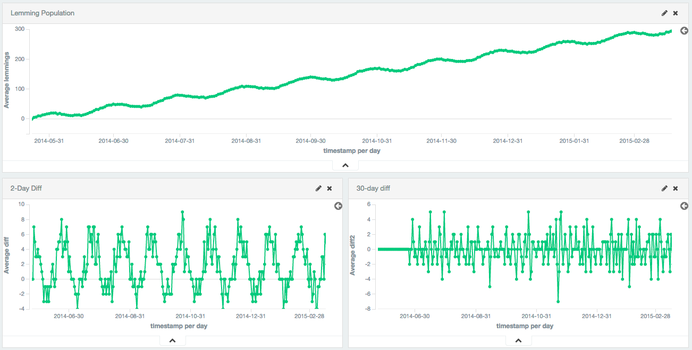

# Serial Differencing Aggregation（串行差异聚合）

原文链接 : [https://www.elastic.co/guide/en/elasticsearch/reference/5.4/search-aggregations-pipeline-serialdiff-aggregation.html](https://www.elastic.co/guide/en/elasticsearch/reference/5.4/search-aggregations-pipeline-serialdiff-aggregation.html)

译文链接 : [http://www.apache.wiki/pages/createpage-entervariables.action?templateId=4816898&spaceKey=Elasticsearch&title=&newSpaceKey=Elasticsearch&fromPageId=10029316](http://www.apache.wiki/pages/createpage-entervariables.action?templateId=4816898&spaceKey=Elasticsearch&title=&newSpaceKey=Elasticsearch&fromPageId=10029316)

贡献者 : [程威](/display/~chengwei)，[ApacheCN](/display/~apachecn)，[Apache中文网](/display/~apachechina)

Warning

这个功能是实验性的，可能会在将来的版本完全更改或者移除。Elastic将采取最大的努力来解决任何问题，但实验性的功能不受SLA官方功能的支持。

 串行差分是将在一个时间序列中的值减去其本身滞后一段时间或周期的值。例如，数据点 f(x) = f(xt) - f(xt-n)，其中n是所使用的周期。

周期1相当于没有时间归一化的导数:它表是从一个点到下一个点的变化。单个周期对于消除不变的线性趋势很有用。

单个周期也可用于将数据转换为固定的序列。在这个例子中，道琼斯指数绘制了超过250天左右。原始数据不是静止的，这会使得很难使用这些数据。

通过计算第一个差值，我们去除趋势数据（例如删除常数，线性趋势）。我们可以看到数据成为一个固定的序列（例如，第一个差异是随机分布在零值附近，似乎没有任何模式/行为）。这个转换揭示了数据集是随机游走的；该值是先前的值加减随机随机。这种洞察允许选择进一步的分析工具。

图15\. 道琼斯数据绘画和通过第一个差值来稳定数据。



可以使用更大的时间段来消除季节性/循环性。在这个例子中，以正弦波+恒定线性趋势+随机噪声综合生成了一个引理群。正弦波有30天的时间。

第一个差异消除了恒定的趋势，只剩下一个正弦波。然后将第30个差值应用于第一个差异以消除循环行为，留下适合于其他分析的固定序列。

图16.绘制了第一和第30个差异的静止数据



## Syntax(句法)

**serial_diff** 聚合看起来像这样：

```
{
    "serial_diff": {
        "buckets_path": "the_sum",
        "lag": "7"
    }
}
```

Table 13\. serial_diff 参数

| 参数名称 | 描述 | 是否必填 | 默认值 |
| --- | --- | --- | --- |
| buckets_path | 感兴趣的度量的路径（更多细节可以看[buckets_path](https://www.elastic.co/guide/en/elasticsearch/reference/5.4/search-aggregations-pipeline.html#buckets-path-syntax) 语法） | 必填 |   |
| lag | 从当前的值减去历史 **bucket**。比如，lag=7表示每次从当前的 **bucket** 的值减去其前面第7个 **bucket** 的值。必须是非零正整数。 | 可选 | 1 |
| gap_policy | 确定遇到数据间隙时的策略 | 可选 | insert_zero |
| format | 格式化聚合输出的值 | 可选 | null |

**serial_diff** 聚合必须嵌入到 **histogram** 或者 **date_histogram** 聚合中:

```
curl -XPOST 'localhost:9200/_search?pretty' -H 'Content-Type: application/json' -d'
{
   "size": 0,
   "aggs": {
      "my_date_histo": {             1     
         "date_histogram": {
            "field": "timestamp",
            "interval": "day"
         },
         "aggs": {
            "the_sum": {
               "sum": {
                  "field": "lemmings"     2
               }
            },
            "thirtieth_difference": {
               "serial_diff": {               3 
                  "buckets_path": "the_sum",
                  "lag" : 30
               }
            }
         }
      }
   }
}
'
```

| 1 |  一个命名为“**date_histogram**” 的 **date_histogram** , 由 timestamp 字段和 一天间隔组成。 |
| 2 | **sum** 度量是用来计算字段的和。可以填很多值（sum, min, max, etc） |
| 3 | 最后，我们指定一个以 **the_sum** 作为输入的 **serial_diff** 聚合。 |

串行差分通过在字段上指定 **histogram **或者 **date_histogram**。你可以选择选择性的添加常规的度量，例如sum。最后  **serial_diff **被嵌入到 **histogram中**。然后 **buckets_path **参数用于指向histogram中的一个同级的度量。（有关buckets_path的语法，请参见[buckets_path](https://www.elastic.co/guide/en/elasticsearch/reference/5.4/search-aggregations-pipeline.html#buckets-path-syntax) 这节）。