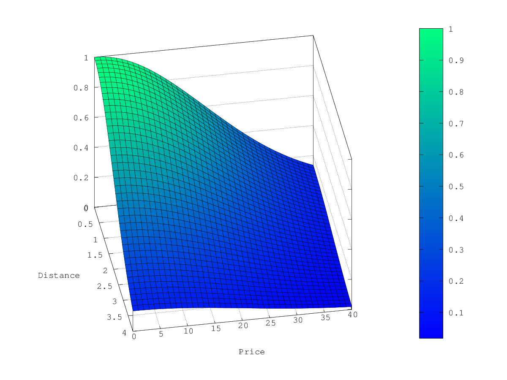
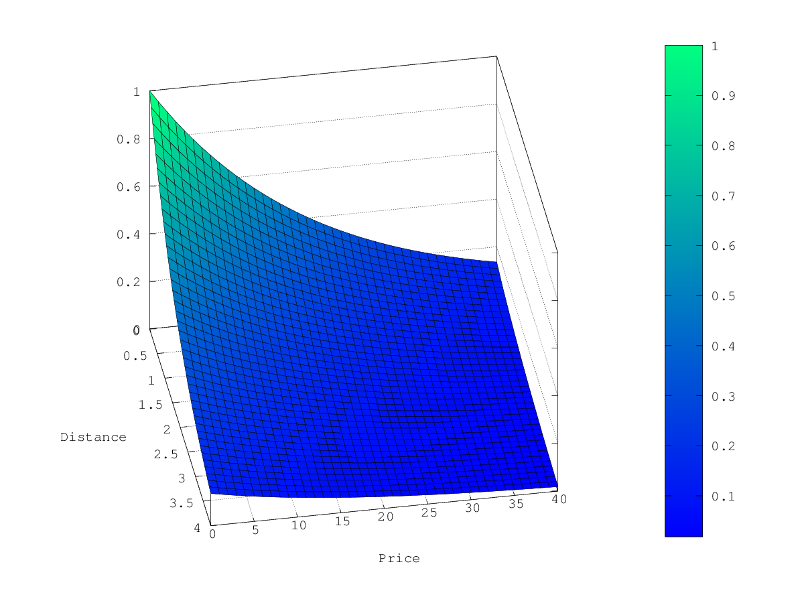
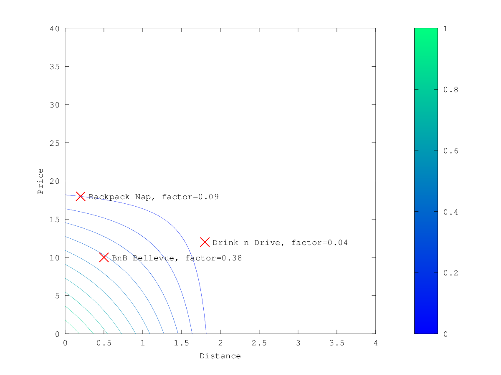
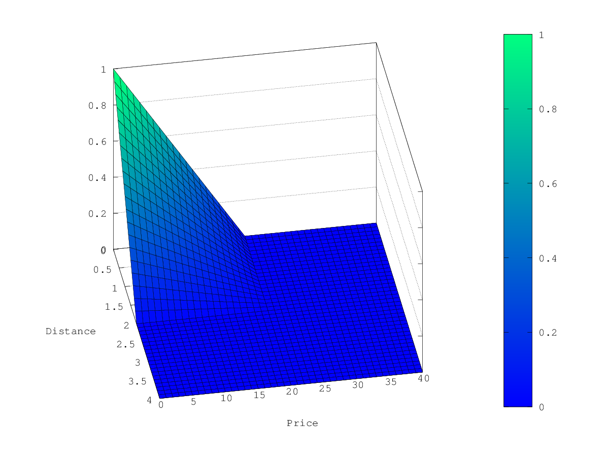

# Function Score 查询

原文链接 : [https://www.elastic.co/guide/en/elasticsearch/reference/5.0/query-dsl-function-score-query.html](https://www.elastic.co/guide/en/elasticsearch/reference/5.0/query-dsl-function-score-query.html)

译文链接 : [http://www.apache.wiki/pages/viewpage.action?pageId=4882904](http://www.apache.wiki/pages/viewpage.action?pageId=4882904)

贡献者 : [蓝色飞扬](/display/~lixiaoqing)

[&lt;&lt; **Dis Max Query**](http://www.apache.wiki/pages/viewpage.action?pageId=4882902)**                                                                                                                      [Boosting Query &gt;&gt;](http://www.apache.wiki/pages/viewpage.action?pageId=4882906)**

* * *

## Function Score Query

**function_score** 允许你修改一个查询检索文档的分数。举例来讲，当得分函数计算代价高昂并且足以在经过滤的文档集合上计算得分，这种查询是有用的。
使用 **function_score** ，用户需要定义一个查询和一个或多个功能，即计算用于由查询返回的每个文档的新得分。
**function_score**  当只有一个功能函数时可参考如下使用：

```
GET /_search
{
    "query": {
        "function_score": {
            "query": { "match_all": {} },
            "boost": "5",
            "random_score": {},//注释1
            "boost_mode":"multiply"
        }
    }
}
```

```
注释1:见 function_score 查询有关支持的函数列表
```

此外，可以组合几个函数使用。 假如要这样使用，当且仅当文档匹配给定的过滤查询时可以根据需要选择应用此函数。

```
GET /_search
{
    "query": {
        "function_score": {
          "query": { "match_all": {} },
          "boost": "5", //注释1
          "functions": [
              {
                  "filter": { "match": { "test": "bar" } },
                  "random_score": {}, //注释2
                  "weight": 23
              },
              {
                  "filter": { "match": { "test": "cat" } },
                  "weight": 42
              }
          ],
          "max_boost": 42,
          "score_mode": "max",
          "boost_mode": "multiply",
          "min_score" : 42
        }
    }
}
```

```
注释1：意为整个查询
```

* * *

注释2:见 **function_score** 查询有关支持的函数列表

每个函数的过滤查询产生的分数无关紧要。

如果函数中没有给定滤器，这是等同于指定给"**_match_all_**": {}
首先，每个文档由定义的函数打分。 参数 _**score_mode **_规定计算的分数如何组合：

| multiply | 分数相乘（默认） |
| sum | 得分相加 |
| avg | 平均分数 |
| first | 使用具有匹配过滤器的第一个函数 |
| max | 最大得分 |
| min | 最小分数 |

因为分数可以在不同的尺度（例如使用除了 **field_value_factor **之外的0和1的递减函数 ），并且有时候函数的得分产生的不同影响正是所期望的，每个函数的分数可以由用户定义的 **_weight_** 参数来调整，_**weight**_ 可以定义在每一个 **functions **阵列（上面的例子）的功能,以此乘以由相应函数计算的分数。如果其他任何功能的声明中没有提到权重， **weight** 只是简单的用于充当返回 **weight** 的函数 。
假如 **_score_mode_** 设为 **avg** 个人得分将由加权平均进行组合。 例如，如果两个函数返回得分1和2以及它们各自的权重是3和4，那么他们的分数将被组合为(1*3+2*4)/(3+4)而不是 (1*3+2*4)/2 。

新得分通过设置 **max_boost** 参数可以不超过某一限值。**max_boost **默认值是 **FLT_MAX**。

新计算的分数与查询的分数相组合，参数 **boost_mode** 定义其组合方式：

| **multiply** | 查询得分和函数得分相乘（默认） |
| **replace** | 仅使用函数得分，忽略查询得分 |
| **sum** | 查询得分和函数得分相加 |
| **avg** | 取平均值 |
| **max** | 查询得分和函数得分的最大值 |
| **min** | 查询得分和函数得分的最小值 |

默认情况下，修改分数不会改变文档的匹配结果。 为了排除不满足一定的分数阈值的文档，可用**min_score**参数设置所期望的得分阈值。

** function_score **查询提供的几种函数分数的类型

*   script_score
*   weight
*   random_score
*   field_value_factor
*   decay functions: gauss, linear, exp

## script_score

** script_score** 功能允许您包装另一个查询，即随意定制用脚本表达式在doc其他数字字段的值派生的计算的得分。 下面是一个简单的示例：

```
"script_score" : {
    "script" : {
      "lang": "painless",
      "inline": "_score * doc['my_numeric_field'].value"
    }
}
```

在上面这些不同的脚本字段值和表达式中，**_score** 脚本参数可被用于检索基于该包装查询的分数。

脚本被缓存得以更快地执行。 如果脚本包含需要考虑的参数，则最好重复使用相同的脚本，并向其提供参数：

```
"script_score": {
    "script": {
        "lang": "painless",
        "params": {
            "param1": value1,
            "param2": value2
        },
        "inline": "_score * doc['my_numeric_field'].value / Math.pow(params.param1, params.param2)"
    }
}
```

需要注意的是与 **custom_score** 查询不同，该查询的评分是与脚本得分相乘的结果。如果要禁止此类用户可增加设置"**boost_mode**": "**replace**"

## weight

**weight **得分即用分数乘以设置的 **weight  **参数,当对特定查询设置的提升值被标准化时，可使用此参数，但此参数对 **score function** 无效。其数值类型为**float**。

```
"weight" : number
```

## Random

** random_score** 根据 **__**ui**d_** 字段进行 **hash** 计算生成分数，可根据 **seed** 发生改变，如果 **_seed_** 未指定，当前时间被使用。

使用此功能将加载用于现场数据 **_uid** ，它的值唯一，适合在内存操作频繁的情况下使用。

```
"random_score": {
    "seed" : number
}
```

## field_value_factor

**field_value_factor** 功能允许您使用从文档获取的字段影响得分。 它类似于使用 **script_score** **function**，但是，它避免了脚本的开销。 如果在多值字段上使用，则只有字段的第一个值用于计算。

举个例子，假设你有一个在 **popularity** 域建有数字索引的文档，并希望以此域影响该文档的分数，通常采用如下方法：

```
"field_value_factor": {
  "field": "popularity",
  "factor": 1.2,
  "modifier": "sqrt",
  "missing": 1
}
```

这将会转换为以下公式来计算得分：

sqrt(1.2 * doc['popularity'].value)

有以下一系列可选参数用于**field_value_factor** 功能

| field | 要从文档中提取的字段。 |
| factor | 与字段值相乘的可选系数，默认为1 。 |
| modifier | 修改适用于该字段的值，可以是以下之一： none ， log ， log1p ， log2p ， ln ， ln1p ，ln2p ， square ， sqrt ，还是reciprocal 。 默认为none 。 |

| 修饰符 | 含义 |
| none | 不要对字段值使用任何乘数 |
| log | 取字段值的[对数](https://en.wikipedia.org/wiki/Logarithm)[](https://translate.googleusercontent.com/translate_c?depth=1&hl=zh-CN&rurl=translate.google.com.hk&sl=en&tl=zh-CN&u=https://en.wikipedia.org/wiki/Logarithm&usg=ALkJrhh3MUvWC89n1nR7Lo0hKyZsLxwcHw) |
| log1p | 字段值加1，并取对数 |
| log2p | 字段值加2，并取对数 |
| ln | 取字段值的[自然对数](https://en.wikipedia.org/wiki/Natural_logarithm) |
| ln1p | 字段值加1，并取自然对数 |
| ln2p | 字段值加2，并取自然对数 |
| square | 字段值的平方（乘以它自身） |
| sqrt | 字段值的[平方根](https://en.wikipedia.org/wiki/Square_root) |
| reciprocal | 字段值的[Reciprocate](https://en.wikipedia.org/wiki/Multiplicative_inverse)形式，例如1/x ，其中x是该字段的值 |

**missing**

如果文档没有该字段，则使用此值。 修饰符和因子也使用此值，如同从文档中读取的字段一样使用。
记住，取log()为0，或者负数的平方根 是一个非法操作，程序会抛出异常。 一定要使用范围过滤器限制此字段取值来避免这种情况，或使用`log1p`和 `ln1p`。

## Decay functions

**Decay functions** 对 最初用户已给定了数字字段值的距离衰减函数的文档进行计分。 这类似于**range query**，但具有滑动窗口而不是定值。

在具有数字字段的查询使用 **distance scoring**，用户应为每个字段定义 **origin** 和 **scale **。 **origin  **需要定义从该计算距离的“中心点”，而 **scale** 来定义衰减程度。 **decay function** 指定用法为:

```
"DECAY_FUNCTION": { //注释1
    "FIELD_NAME": { //注释2
          "origin": "11, 12",
          "scale": "2km",
          "offset": "0km",
          "decay": 0.33
    }
}
```

| 

```
注释1
```

 | DECAY_FUNCTION应从linear ， exp ，gauss 中取值。 |
| 

```
注释2
```

 | 指定的字段值必须是数字，date或 geo-point |

在上面的例子中，该字段取值 **geo_point** 并且可初始化为地理区域的格式。在这种情况下，**scale** 和 **offset** 必须指定一个单位。 如果你的领域是一个 **date** ，您可以设置 **scale** 和 **offset** 为天、周，依此类推。 例：

```
    "gauss": {
        "date": {
              "origin": "2013-09-17", //注释1
              "scale": "10d",
              "offset": "5d", //注释2
              "decay" : 0.5   //注释3
        }
    }
```

| 

```
注释1
```

 | date format 的初始定义取决于在映射定义的 format。 如果不给定初始值，则使用当前时间。 |
| 

```
注释2
```

 | **offset** 和 **decay** 参数是可选参数。 |
| 

```
注释3
```

 | 

&#124; **_origin_** &#124; 用于计算距离的初始值。 必须按照数字字段存放数字，日期字段存放日期和 地理位置字段存放地理位置的方式指定。 必需包含 geo 和 numeric。 对于 date 默认为now 。 日期初始化可以使用算术形式（例如now-1h）。 &#124;
&#124; **scale** &#124; 需要给定所有类型。 定义从**origin** + **offset** 开始计算等于 **decay** 的分数的距离。  对于geo：可以定义为number+unit（1km，12m，...）。 默认单位为米。  对于date：可以定义为number+unit（“1h”，“10d”，...）。 默认单位为 毫秒。 对于numeric：任意数字 &#124;
&#124; **_offset_** &#124; 如果定义了**offset**，则将使用比 **offset  **更大的距离来计算文档的衰变函数。默认值为0。 &#124;
&#124; **_decay_** &#124; **decay** 参数定义了根据 **scale** 给定的距离如何给文档打分 。 如果没有定义 **decay** ，文件计算距离时 **scale** 取值0.5。 &#124;

 |

在第一个示例中，您的文档可能代表酒店，并包含地理位置字段。 您想根据酒店距离给定位置的距离计算衰减函数。 您可能不会立即看到为gauss function选择的scale，但您可以说：“在距离所需位置2公里处，分数应该减少到三分之一。 然后参数“scale”将自动调整以确保score function针对距离期望位置2km的酒店计算得分0.33。 

在第二个示例中，字段值介于2013-09-12和2013-09-22之间的文档将获得1.0的权重，并且从该日期起15天的文档的权重为0.5。

## Supported decay functions

 DECAY_FUNCTION 决定了衰减的形状：

**_gauss_**

正常衰减，计算公式为：


在这里 用于计算以确保该得分采用值 _**decay**_ 是 _**scale**_ 与 **_origin_** + - **_offset_** 的距离


见 [Normal decay ,关键字 gauss](https://www.elastic.co/guide/en/elasticsearch/reference/5.0/query-dsl-function-score-query.html#gauss-decay) 的图表展示了生成的曲线 _**gauss function**_。

**_exp_**

指数衰减，计算公式为：


再次指出参数用于计算以确保该得分采用值 _**decay** _是 _**scale** _与 **_origin_ **+ - **_offset_ **的距离


见 [exponential decay ,关键字 exp](https://www.elastic.co/guide/en/elasticsearch/reference/5.0/query-dsl-function-score-query.html#exp-decay) 为图展示了生成的曲线 _**exp function**_。

**linear**

线性衰减，计算公式为：


在这里参数s用于计算以确保该得分采用值 _**decay** _是 _**scale** _与 **_origin_ **+ - **_offset_ **的距离


与normal decay 和exponential decay ，如果字段值超过用户给定的scale 值的两倍，则此函数实际将分数设置为0

对于单个函数，三个decay functions及其参数的可视化形式如这样（在该示例中的字段“age”）：

**__**

## Multi-values fields

如果用于计算 **decay** 的字段包含多个值，则默认情况下选择最接近原点的值以确定距离。 这可以通过设置 **_multi_value_mode_** 来改变

| min | 最小距离 |
| max | 最大距离 |
| avg | 平均距离 |
| sum | 所有距离的总和 |

例：

```
  “DECAY_FUNCTION”：{
         “FIELD_NAME”：{
               “origin”：...，
               “scale”：...
         }，
         “multi_value_mode”：“avg”
     }} 
```

## Detailed example

假设您正在搜索某个城镇的酒店。 您的预算有限。 此外，您希望酒店靠近市中心，所以酒店距离所需的位置越远，您就越不可能办理入住手续。

您希望与您的标准（例如，“hotel，Nancy，non-smoker”）匹配的查询结果相对于与市中心的距离以及价格进行评分。

直觉上，你想定义市中心为原点，也许你愿意从酒店步行2公里到市中心。 在这种情况下，您的 **scale** 字段初始值是市中心 〜2公里。

如果你的预算低，你可能更喜欢在昂贵的东西以上的东西。 对于价格，初始值是0欧元或者scale 取决于你愿意付出多少，例如20欧元。

在该示例中，字段可以被称为酒店的价格的“price”和该酒店的坐标的“location”。

price函数在这种场景下定义为：

```
"gauss": { //注释1
    "price": {
          "origin": "0",
          "scale": "20"
    }
}
```

注释1：此时 **decay function** 也可以使用 **linear** 或 **exp**

**location** 定义为:

```
"gauss": { //注释1
    "location": {
          "origin": "11, 12",
          "scale": "2km"
    }
}
```

注释1：此时 **decay function** 也可以使用 **linear** 或 **exp**

假设你想在原始分数上乘以这两个函数，请求将如下所示:

```
GET /_search
{
    "query": {
        "function_score": {
          "functions": [
            {
              "gauss": {
                "price": {
                  "origin": "0",
                  "scale": "20"
                }
              }
            },
            {
              "gauss": {
                "location": {
                  "origin": "11, 12",
                  "scale": "2km"
                }
              }
            }
          ],
          "query": {
            "match": {
              "properties": "balcony"
            }
          },
          "score_mode": "multiply"
        }
    }
}
```

接下来，我们将展示三种可能衰变函数中的每一种的计算得分如何。

## **Normal decay, keyword** gauss

当上面的例子中选择 **gauss** 作为 **decay function**，乘法器的轮廓和表面积如下所示：




假设您的最初搜索结果与下面三家酒店相符：

*   "Backback Nap"
*   "Drink n Drive"
*   "BnB Bellevue".

"Drink n Drive"距离你定义的位置（近2公里），不是太便宜（约13欧元），所以它得到一个低因素为0.56的因素。 “BnB Bellevue”和“Backback Nap”都非常接近定义的位置，但“BnB Bellevue”更便宜，所以它的乘数为0.86，而“Backpack Nap”的值为0.66

## **Exponential decay, keyword** exp

当上面的例子中选择 **exp** 作为 **decay function** ，乘法器的轮廓和表面积如下所示：




## **Linear decay, keyword** linear

当上面的例子中选择 **linear** 作为 **decay function** ，乘法器的轮廓和表面积如下所示：





## 衰减函数支持的范围

仅支持数字，日期和地理位置字段。

## 缺少字段时如何处理？

如果文档中缺少数字字段，函数将返回1。

* * *

[&lt;&lt; **Dis Max Query**](http://www.apache.wiki/pages/viewpage.action?pageId=4882902) **[Boosting Query &gt;&gt;](http://www.apache.wiki/pages/viewpage.action?pageId=4882906)**