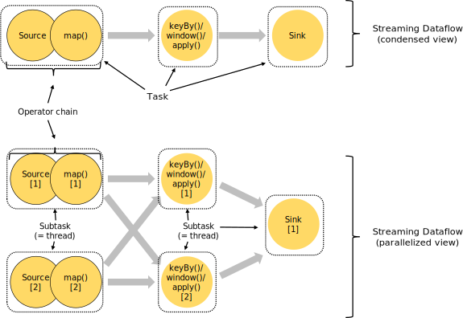
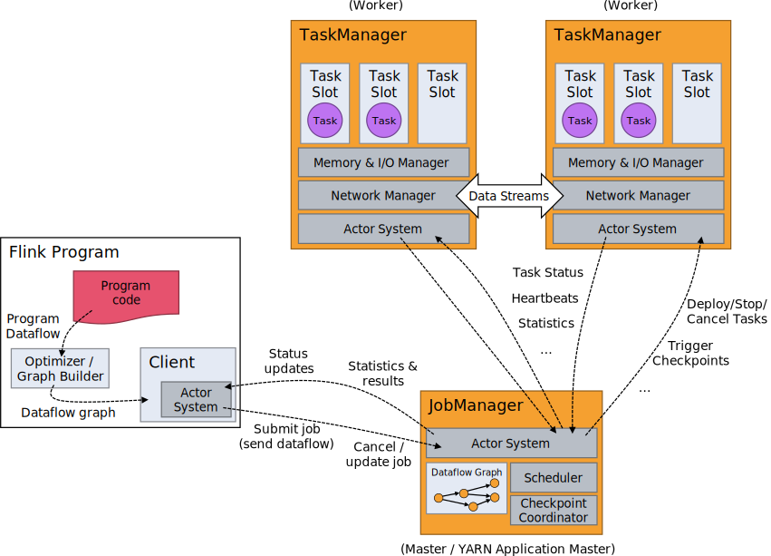
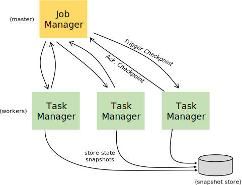

# 分布式运行环境

## 任务和操作链

对于分布式执行，Flink将 _chains_ 操作符子任务合并到 _tasks_ 中。每个任务由一个线程执行。将操作符链接到任务中是一种有用的优化:它减少了线程间切换和缓冲的开销，在降低延迟的同时增加了总体吞吐量。可以配置链接行为;有关详细信息，请参见[chaining docs](../dev/stream/operators/#task-chaining-and-resource-groups)。

下图中的示例数据流使用5个子任务执行，因此使用5个并行线程执行。

## 工作管理器, 任务管理器, 客户端

Flink运行时由两种类型的进程组成:

*   **JobManagers**(也称为 _masters_ )协调分布式执行。它们调度任务、协调检查点、协调故障恢复，等等。

    总有至少一个作业管理器。高可用性设置将具有多个 jobmanager，其中一个始终是 _leader_，其他的都是 _standby_。

*   **TaskManagers**(也称为 _workers_)执行数据流的 _tasks_(或者更具体地说是子任务)，并缓冲和交换数据 _streams_。

    必须始终至少有一个任务管理器。

jobmanager和taskmanager可以以多种方式启动:直接在机器上作为 [standalone cluster](../ops/deployment/cluster_setup.html)、容器中启动，或者由[YARN](../ops/deployment/yarn_setup.html)或[Mesos](../ops/deployment/mesos.html)等资源框架管理。taskmanager连接到jobmanager，宣布自己可用，并被分配工作。

**client**不是运行时和程序执行的一部分，而是用来准备和发送数据流到JobManager。之后，客户端可以断开连接，或者保持连接以接收进度报告。客户端要么作为触发执行的Java/Scala程序的一部分运行，要么在命令行进程中运行`./bin/flink run ...`。

## 任务槽和资源

每个worker (TaskManager)是一个 _JVM process_，可以在单独的线程中执行一个或多个子任务。为了控制工作者接受多少任务，工作者有所谓的**task slots** (至少一个)。

每个 _task slot_ 表示TaskManager资源的一个固定子集。例如，带有三个插槽的TaskManager将把其托管内存的1/3专用于每个插槽。划分资源意味着子任务不会与来自其他作业的子任务竞争托管内存，而是具有一定数量的预留托管内存。注意，这里不存在CPU隔离;当前插槽只分离任务的托管内存。

通过调整任务槽的数量，用户可以定义子任务如何彼此隔离。每个任务管理器有一个插槽意味着每个任务组运行在单独的JVM中(例如，可以在单独的容器中启动)。拥有多个插槽意味着更多的子任务共享相同的JVM。相同JVM中的任务共享TCP连接(通过多路复用)和心跳消息。它们还可以共享数据集和数据结构，从而减少每个任务的开销。

默认情况下，Flink允许子任务共享槽，即使它们是不同任务的子任务，只要它们来自相同的作业。结果，一个槽可以容纳作业的整个管道。允许这个 _slot sharing_ 有两个主要好处:

*   Flink集群需要的任务槽数与作业中使用的最高并行度正好相同。不需要计算一个程序总共包含多少任务(具有不同的并行性)。

*   更容易得到更好的资源利用。如果没有槽共享，非密集型 _source/map()_ 子任务阻塞的资源与资源密集型 _window_ 子任务阻塞的资源一样多。通过槽共享，将我们示例中的基本并行度从2提高到6，可以充分利用槽资源，同时确保繁重的子任务公平地分布在taskmanager中。

api还包括_[resource group](../dev/stream/operators/#task-chaining-and-resource-groups)_机制，可用于防止不希望的槽共享。

根据经验，一个好的默认任务槽数应该是CPU内核的数量。对于超线程，每个槽需要2个或更多的硬件线程上下文。

## 后端状态

存储键/值索引的确切数据结构取决于所选的[state backend](../ops/state/state_backends.html)。一个状态后端在内存哈希映射中存储数据，另一个状态后端使用[RocksDB](http://rocksdb.org) 作为键/值存储。除了定义保存状态的数据结构外，状态后端还实现了获取键/值状态的时间点快照并将该快照存储为检查点的一部分的逻辑。

## 保存点

在数据流API中编写的程序可以从**保存点**恢复执行。保存点允许在不丢失任何状态的情况下更新程序和Flink集群。

[Savepoints](../ops/state/savepoints.html) 是**manually triggered checkpoints**，它获取程序的快照并将其写入状态后端。为此，它们依赖于常规的检查点机制。在执行期间，在工作节点上定期对程序进行快照，并生成检查点。对于恢复，只需要最后一个完成的检查点，旧的检查点可以在新检查点完成时安全丢弃。

保存点与这些定期检查点类似，不同之处在于它们是由**用户触发**的，并且在完成更新的检查点时**不会自动过期**。保存点可以从[command line](../ops/cli.html#savepoints)或通过[REST API](../monitoring/rest_api.html#cancel-job-with-savepoint)取消作业时创建。

