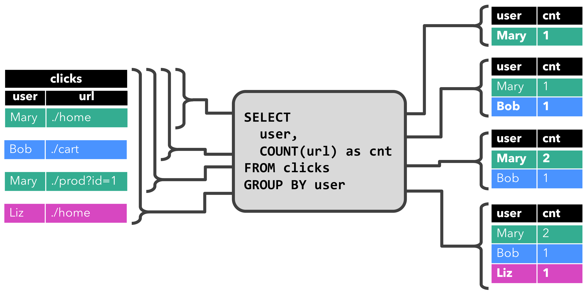

#动态表
SQL和关系代数并没有考虑到流数据。因此，在关系代数（和SQL）和流处理之间几乎没有概念上的差距。

本页讨论了这些差异，并解释了Flink如何在无边界数据上实现与常规数据库引擎在有边界数据上相同的语义。

##数据流上的关系查询
下表比较了传统的关系代数和流处理，包括输入数据、执行和输出结果。

|关系代数|SQL流处理|
| --- | --- |
|关系（或表）是有界（多）元组集。|流是一个无限的元组序列。|
|对批处理数据（例如关系数据库中的表）执行的查询可以访问完整的输入数据。|流式查询在启动时无法访问所有数据，必须“等待类型的”数据流入。|
|批查询在产生固定大小的结果后终止。|流式查询会根据接收到的记录不断更新其结果，并且永远不会完成。|

尽管存在这些差异，但使用关系查询和SQL处理流并非不可能。高级关系数据库系统提供了一个名为“物化视图”的功能。物化视图就像常规虚拟视图一样定义为SQL查询。但与虚拟视图不同，物化视图缓存查询结果，这样在访问视图时就不需要计算查询。缓存的一个常见挑战是防止缓存提供过时的结果。当修改其定义查询的基表时，物化视图将过时。_热切的视图维护是一种在基本表更新后立即更新物化视图的技术。
如果我们考虑以下因素，那么在流上的热切视图维护和SQL查询之间的联系就会变得明显：

* 数据库表是“insert”、“update”和“delete”dml语句的结果，通常称为“changelog stream”。

* 物化视图定义为SQL查询。为了更新视图，查询会连续处理视图基本关系的changelog流。

* 物化视图是流式SQL查询的结果。

考虑到这些要点，我们将在下一节中介绍以下“动态表”的概念。
## 动态表和连续查询

_动态表是Flink的表API和对流数据的SQL支持的核心概念。与表示批处理数据的静态表不同，动态表随时间变化。它们可以像静态批处理表一样被查询。查询动态表会产生一个连续查询。连续查询不会终止并生成动态表。查询不断更新其（动态）结果表，以反映其（动态）输入表上的更改。本质上，动态表上的连续查询与定义物化视图的查询非常相似。

需要注意的是，连续查询的结果在语义上总是等价于在输入表的快照上以批处理模式执行的相同查询的结果。

下图显示了流、动态表和连续查询的关系：

<center></center>

1.流被转换为动态表。

2.对动态表进行连续查询，生成新的动态表。

3.生成的动态表被转换回流。

**注意:** 动态表首先是一个逻辑概念。在查询执行期间，不必（完全）实现动态表。

在下面的内容中，我们将用具有以下模式的单击事件流解释动态表和连续查询的概念：

```
[
  user:  VARCHAR,   // the name of the user
  cTime: TIMESTAMP, // the time when the URL was accessed
  url:   VARCHAR    // the URL that was accessed by the user
]
```


##在流上定义表
为了使用关系查询处理流，必须将其转换为“table”。从概念上讲，流的每个记录都被解释为对结果表的“insert”修改。本质上，我们是从“insert”（仅插入）changelog流构建一个表。

下图显示了单击事件流（左侧）如何转换为表（右侧）。当插入更多的点击流记录时，结果表不断增长。

<center></center>

**注意:** 在流上定义的表在内部没有具体化。
###连续查询
* * *

在动态表上对连续查询进行计算，并生成新的动态表。与批处理查询不同，连续查询从不根据输入表上的更新来终止和更新其结果表。在任何时间点上，连续查询的结果在语义上都等同于在输入表的快照上以批处理模式执行的相同查询的结果。

在下面的示例中，我们展示了在click事件流中定义的“clicks”表上的两个查询。

第一个查询是一个简单的“按计数分组”聚合查询。它对“user”字段中的“clicks”表进行分组，并计算访问的URL数。下图显示了当用其他行更新“clicks”表时，如何随时间计算查询。
<center></center>

启动查询时，“clicks”表（左侧）为空。当第一行插入到“clicks”表中时，查询开始计算结果表。在插入第一行`[mary，…/home]`后，结果表（右侧，顶部）由一行`[mary，1]`组成。当第二行`[bob，../cart]`插入到“clicks”表中时，查询将更新结果表并插入新行`[bob，1]`。第三排`[Mary，…/Prod？id=1]`生成已计算结果行的更新，使`[mary，1]`更新为`[mary，2]`。最后，当第四行附加到“clicks”表时，查询会将第三行`[liz，1]`插入到结果表中。

第二个查询类似于第一个查询，但在计算URL数之前，除了“user”属性外，还将“clicks”表分组到[每小时滚动窗口]（../sql.html group windows）上（如windows等基于时间的计算基于特殊的[时间属性]（time attributes.html），稍后将进行讨论）。图中再次显示了不同时间点的输入和输出，以可视化动态表的变化性质。

<center></center>

和以前一样，输入表“clicks”显示在左侧。查询每小时连续计算结果并更新结果表。clicks表包含四行，时间戳（`ctime`）介于'12:00:00'和'12:59:59`。查询从这个输入计算两个结果行（每个“用户”一个），并将它们附加到结果表中。对于“13:00:00”和“13:59:59”之间的下一个窗口，“clicks”表包含三行，这将导致另外两行追加到结果表中。随着时间的推移，更多的行被追加到“clicks”中，结果表将被更新。

###更新和追加查询
尽管两个示例查询看起来非常相似（都计算分组计数聚合），但它们在一个重要方面有所不同：

* 第一个查询更新以前发出的结果，即定义结果表的changelog流包含“insert”和“update”更改。

* 第二个查询只附加到结果表，即结果表的changelog流只包含'insert'更改。

查询是生成仅追加表还是生成更新的表，都有一些含义：

* 产生更新更改的查询通常需要保持更多的状态（请参见以下部分）。
* 将仅追加表转换为流与更新表的转换不同（请参阅[表到流转换]（表到流转换）部分）。
###查询限制
许多（但不是全部）语义有效的查询可以作为流上的连续查询进行计算。有些查询的计算成本太高，要么是因为它们需要维护的状态太大，要么是因为计算更新太昂贵。

* **状态大小:** 连续查询是在未绑定的流上进行计算的，通常应该运行数周或数月。因此，连续查询处理的数据总量可能非常大。必须更新以前发出的结果的查询需要维护所有发出的行，以便能够更新它们。例如，第一个示例查询需要存储每个用户的URL计数，以便在输入表接收到新行时增加计数并发送新结果。如果只跟踪注册用户，则要维护的计数数可能不会太高。但是，如果非注册用户分配了唯一的用户名，则要维护的计数数将随着时间的推移而增加，并可能最终导致查询失败。


```
SELECT user, COUNT(url)
FROM clicks
GROUP BY user;
```


* **计算更新:** 有些查询需要重新计算和更新大部分已发出结果行，即使只添加或更新了一条输入记录。显然，这种查询不太适合作为连续查询执行。下面的查询就是一个例子，它根据上一次单击的时间为每个用户计算一个“rank”。一旦“clicks”表接收到新行，用户的“lastaction”就会更新，并且必须计算新的排名。但是，由于两行不能具有相同的列组，因此所有排名较低的行也需要更新。


```
SELECT user, RANK() OVER (ORDER BY lastLogin)
FROM (
  SELECT user, MAX(cTime) AS lastAction FROM clicks GROUP BY user
);
```


[查询配置]（query_configuration.html）页面讨论控制连续查询执行的参数。一些参数可以用来交换保持状态的大小以获得结果的准确性。


##表到流转换


动态表可以像常规数据库表一样，通过“insert”、“update”和“delete”更改进行连续修改。它可能是一个只有一行的表，不断更新，或者是一个没有“update”和“delete”修改的只插入表，或者两者之间的任何内容。


将动态表转换为流或将其写入外部系统时，需要对这些更改进行编码。Flink的表API和SQL支持三种方法来编码动态表的更改：

* **仅追加流:** 只能由“insert”更改修改的动态表可以通过发出插入的行转换为流。

* **收回流:** 收回流是包含两种类型的消息的流，即“添加消息”和“收回消息”。动态表通过将“insert”更改编码为“add message”、“delete”更改编码为“retract message”以及将“update”更改编码为“retract message for the updated（previous）row”和“add message for the updating（new）row”转换为收回流。下图显示了将动态表转换为收回流的过程。

<center></center>

* **upsert-stream:** upsert-stream是一个包含两种类型消息的流，分别是“upsert-messages”和“delete-messages”。转换为upsert流的动态表需要（可能是复合的）唯一键。带有唯一键的动态表通过将“insert”和“update”更改编码为upsert消息，将“delete”更改编码为delete消息，转换为流。流消耗运算符需要知道唯一键属性才能正确应用消息。与收回流的主要区别在于，“更新”更改是用单个消息编码的，因此效率更高。下图显示了将动态表转换为upsert流的过程。

<center></center>

在[common concepts]（../common.html convert-a-table-into-a-datastream）页面上讨论了将动态表转换为“数据流”的API。请注意，在将动态表转换为“datastream”时，只支持追加和收回流。在[tablesources and tablesinks]（../sourcesinks.html_define-a-tablesink）页上讨论了将动态表发送到外部系统的“tablesink”接口。
