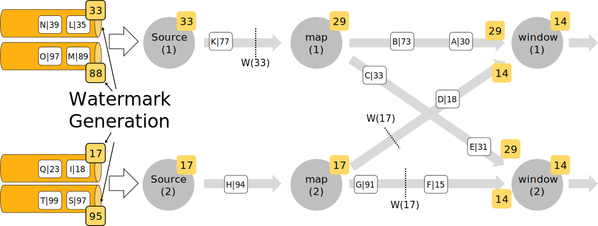

# 生成时间戳/水印

> 译者：[flink.sojb.cn](https://flink.sojb.cn/)


此部分与在**事件时间**运行的程序相关。有关_事件时间_， _处理时间_和_摄取时间_的[介绍](https://flink.sojb.cn/dev/event_time.html)，请参阅[事件时间简介](https://flink.sojb.cn/dev/event_time.html)。

要处理_事件时间_，流式传输程序需要相应地设置_时间特性_。

*   [**Java**](#tab_java_0)
*   [**Scala**](#tab_scala_0)


```
final StreamExecutionEnvironment env = StreamExecutionEnvironment.getExecutionEnvironment();
env.setStreamTimeCharacteristic(TimeCharacteristic.EventTime);
```


```
val env = StreamExecutionEnvironment.getExecutionEnvironment
env.setStreamTimeCharacteristic(TimeCharacteristic.EventTime)
```


## 分配时间戳

为了处理_事件时间_，Flink需要知道事件的_时间戳_，这意味着流中的每个数据元都需要_分配_其事件时间戳。这通常通过从数据元中的某个字段访问/提取时间戳来完成。

时间戳分配与生成水印密切相关，水印告诉系统事件时间的进展。

有两种方法可以分配时间戳并生成水印：

1.  直接在数据流源中
2.  通过时间戳分配器/水印生成器：在Flink中，时间戳分配器还定义要发出的水印

注意自1970-01-01T00：00：00Z的Java纪元以来，时间戳和水印都指定为毫秒。

### 带时间戳和水印的源函数

流源可以直接为它们生成的数据元分配时间戳，也可以发出水印。完成此 算子操作后，不需要时间戳分配器。请注意，如果使用时间戳分配器，则源将提供的任何时间戳和水印都将被覆盖。

要直接为源中的数据元分配时间戳，源必须使用该`collectWithTimestamp(...)` 方法`SourceContext`。要生成水印，源必须调用该`emitWatermark(Watermark)`函数。

下面是一个_（非检查点）_源的简单示例，它分配时间戳并生成水印：

*   [**Java**](#tab_java_1)
*   [**Scala**](#tab_scala_1)


```
@Override
public void run(SourceContext<MyType> ctx) throws Exception {
	while (/* condition */) {
		MyType next = getNext();
		ctx.collectWithTimestamp(next, next.getEventTimestamp());

		if (next.hasWatermarkTime()) {
			ctx.emitWatermark(new Watermark(next.getWatermarkTime()));
		}
	}
}
```


```
override def run(ctx: SourceContext[MyType]): Unit = {
	while (/* condition */) {
		val next: MyType = getNext()
		ctx.collectWithTimestamp(next, next.eventTimestamp)

		if (next.hasWatermarkTime) {
			ctx.emitWatermark(new Watermark(next.getWatermarkTime))
		}
	}
}
```


### 时间戳分配器/水印生成器

时间戳分配器获取流并生成带有带时间戳数据元和水印的新流。如果原始流已经有时间戳和/或水印，则时间戳分配器会覆盖它们。

时间戳分配器通常在数据源之后立即指定，但并非严格要求这样做。例如，常见的模式是在时间戳分配器之前解析（_MapFunction_）和过滤（_FilterFunction_）。在任何情况下，需要在事件时间的第一个 算子操作之前指定时间戳分配器（例如第一个窗口 算子操作）。作为一种特殊情况，当使用Kafka作为流式传输作业的源时，Flink允许在源（或消费者）本身内指定时间戳分配器/水印发射器。有关如何 算子操作的更多信息，请参阅 [Kafka Connector文档](https://flink.sojb.cn/dev/connectors/kafka.html)。

**注意：**本节的其余部分介绍了程序员必须实现的主要接口，以便创建自己的时间戳提取器/水印发射器。要查看Flink附带的预先实现的提取器，请参阅 [预定义的时间戳提取器/水印发射器](https://flink.sojb.cn/dev/event_timestamp_extractors.html)页面。

*   [**Java**](#tab_java_2)
*   [**Scala**](#tab_scala_2)


```
final StreamExecutionEnvironment env = StreamExecutionEnvironment.getExecutionEnvironment();
env.setStreamTimeCharacteristic(TimeCharacteristic.EventTime);

DataStream<MyEvent> stream = env.readFile(
        myFormat, myFilePath, FileProcessingMode.PROCESS_CONTINUOUSLY, 100,
        FilePathFilter.createDefaultFilter(), typeInfo);

DataStream<MyEvent> withTimestampsAndWatermarks = stream
        .filter( event -> event.severity() == WARNING )
        .assignTimestampsAndWatermarks(new MyTimestampsAndWatermarks());

withTimestampsAndWatermarks
        .keyBy( (event) -> event.getGroup() )
        .timeWindow(Time.seconds(10))
        .reduce( (a, b) -> a.add(b) )
        .addSink(...);
```


```
val env = StreamExecutionEnvironment.getExecutionEnvironment
env.setStreamTimeCharacteristic(TimeCharacteristic.EventTime)

val stream: DataStream[MyEvent] = env.readFile(
         myFormat, myFilePath, FileProcessingMode.PROCESS_CONTINUOUSLY, 100,
         FilePathFilter.createDefaultFilter())

val withTimestampsAndWatermarks: DataStream[MyEvent] = stream
        .filter( _.severity == WARNING )
        .assignTimestampsAndWatermarks(new MyTimestampsAndWatermarks())

withTimestampsAndWatermarks
        .keyBy( _.getGroup )
        .timeWindow(Time.seconds(10))
        .reduce( (a, b) => a.add(b) )
        .addSink(...)
```


#### **使用周期性水印**

`AssignerWithPeriodicWatermarks` 分配时间戳并定期生成水印（可能取决于流数据元，或纯粹基于处理时间）。

通过生成水印的间隔（每_n_毫秒）定义 `ExecutionConfig.setAutoWatermarkInterval(...)`。`getCurrentWatermark()`每次调用分配器的方法，如果返回的水印非空并且大于先前的水印，则将发出新的水印。

这里我们展示了两个使用周期性水印生成的时间戳分配器的简单示例。请注意，Flink附带了`BoundedOutOfOrdernessTimestampExtractor`类似于`BoundedOutOfOrdernessGenerator`下面所示的内容，您可以在[此处](https://flink.sojb.cn/dev/event_timestamp_extractors.html#assigners-allowing-a-fixed-amount-of-lateness)阅读。

*   [**Java**](#tab_java_3)
*   [**Scala**](#tab_scala_3)


```
/**
 * This generator generates watermarks assuming that elements arrive out of order,
 * but only to a certain degree. The latest elements for a certain timestamp t will arrive
 * at most n milliseconds after the earliest elements for timestamp t.
 */
public class BoundedOutOfOrdernessGenerator implements AssignerWithPeriodicWatermarks<MyEvent> {

    private final long maxOutOfOrderness = 3500; // 3.5 seconds

    private long currentMaxTimestamp;

    @Override
    public long extractTimestamp(MyEvent element, long previousElementTimestamp) {
        long timestamp = element.getCreationTime();
        currentMaxTimestamp = Math.max(timestamp, currentMaxTimestamp);
        return timestamp;
    }

    @Override
    public Watermark getCurrentWatermark() {
        // return the watermark as current highest timestamp minus the out-of-orderness bound
        return new Watermark(currentMaxTimestamp - maxOutOfOrderness);
    }
}

/**
 * This generator generates watermarks that are lagging behind processing time by a fixed amount.
 * It assumes that elements arrive in Flink after a bounded delay.
 */
public class TimeLagWatermarkGenerator implements AssignerWithPeriodicWatermarks<MyEvent> {

	private final long maxTimeLag = 5000; // 5 seconds

	@Override
	public long extractTimestamp(MyEvent element, long previousElementTimestamp) {
		return element.getCreationTime();
	}

	@Override
	public Watermark getCurrentWatermark() {
		// return the watermark as current time minus the maximum time lag
		return new Watermark(System.currentTimeMillis() - maxTimeLag);
	}
}
```


```
/**
 * This generator generates watermarks assuming that elements arrive out of order,
 * but only to a certain degree. The latest elements for a certain timestamp t will arrive
 * at most n milliseconds after the earliest elements for timestamp t.
 */
class BoundedOutOfOrdernessGenerator extends AssignerWithPeriodicWatermarks[MyEvent] {

    val maxOutOfOrderness = 3500L // 3.5 seconds 
    var currentMaxTimestamp: Long = _

    override def extractTimestamp(element: MyEvent, previousElementTimestamp: Long): Long = {
        val timestamp = element.getCreationTime()
        currentMaxTimestamp = max(timestamp, currentMaxTimestamp)
        timestamp
    }

    override def getCurrentWatermark(): Watermark = {
        // return the watermark as current highest timestamp minus the out-of-orderness bound
        new Watermark(currentMaxTimestamp - maxOutOfOrderness)
    }
}

/**
 * This generator generates watermarks that are lagging behind processing time by a fixed amount.
 * It assumes that elements arrive in Flink after a bounded delay.
 */
class TimeLagWatermarkGenerator extends AssignerWithPeriodicWatermarks[MyEvent] {

    val maxTimeLag = 5000L // 5 seconds 
    override def extractTimestamp(element: MyEvent, previousElementTimestamp: Long): Long = {
        element.getCreationTime
    }

    override def getCurrentWatermark(): Watermark = {
        // return the watermark as current time minus the maximum time lag
        new Watermark(System.currentTimeMillis() - maxTimeLag)
    }
}
```


#### **带有标点符号**

要在某个事件指示可能生成新水印时生成水印，请使用 `AssignerWithPunctuatedWatermarks`。对于此类，Flink将首先调用该`extractTimestamp(...)`方法为数据元分配时间戳，然后立即调用该`checkAndGetNextWatermark(...)`数据元上的 方法。

该`checkAndGetNextWatermark(...)`方法传递方法中分配的时间戳`extractTimestamp(...)` ，并可以决定是否要生成水印。每当该`checkAndGetNextWatermark(...)` 方法返回非空水印，并且该水印大于最新的先前水印时，将发出该新水印。

*   [**Java**](#tab_java_4)
*   [**Scala**](#tab_scala_4)


```
public class PunctuatedAssigner implements AssignerWithPunctuatedWatermarks<MyEvent> {

	@Override
	public long extractTimestamp(MyEvent element, long previousElementTimestamp) {
		return element.getCreationTime();
	}

	@Override
	public Watermark checkAndGetNextWatermark(MyEvent lastElement, long extractedTimestamp) {
		return lastElement.hasWatermarkMarker() ? new Watermark(extractedTimestamp) : null;
	}
}
```


```
class PunctuatedAssigner extends AssignerWithPunctuatedWatermarks[MyEvent] {

	override def extractTimestamp(element: MyEvent, previousElementTimestamp: Long): Long = {
		element.getCreationTime
	}

	override def checkAndGetNextWatermark(lastElement: MyEvent, extractedTimestamp: Long): Watermark = {
		if (lastElement.hasWatermarkMarker()) new Watermark(extractedTimestamp) else null
	}
}
```


_注意：_可以在每个事件上生成水印。然而，因为每个水印在下游引起一些计算，所以过多的水印会降低性能。

## 每个Kafka分区的时间戳

当使用[Apache Kafka](connectors/kafka.html)作为数据源时，每个Kafka分区可能具有简单的事件时间模式（升序时间戳或有界无序）。但是，当从Kafka消费流时，多个分区通常并行消耗，交错来自分区的事件并破坏每个分区模式（这是Kafka的消费者客户端工作的固有方式）。

在这种情况下，您可以使用Flink的Kafka分区感知水印生成。使用该函数，每个Kafka分区在Kafka使用者内部生成水印，并且每个分区水印的合并方式与在流shuffle上合并水印的方式相同。

例如，如果事件时间戳严格按每个Kafka分区升序，则使用[升序时间戳水印生成器](event_timestamp_extractors.html#assigners-with-ascending-timestamps)生成每分区水印 将产生完美的整体水印。

下图显示了如何使用per-Kafka分区水印生成，以及在这种情况下水印如何通过流数据流传播。

*   [**Java**](#tab_java_5)
*   [**Scala**](#tab_scala_5)


```
FlinkKafkaConsumer09<MyType> kafkaSource = new FlinkKafkaConsumer09<>("myTopic", schema, props);
kafkaSource.assignTimestampsAndWatermarks(new AscendingTimestampExtractor<MyType>() {

    @Override
    public long extractAscendingTimestamp(MyType element) {
        return element.eventTimestamp();
    }
});

DataStream<MyType> stream = env.addSource(kafkaSource);
```


```
val kafkaSource = new FlinkKafkaConsumer09[MyType]("myTopic", schema, props)
kafkaSource.assignTimestampsAndWatermarks(new AscendingTimestampExtractor[MyType] {
    def extractAscendingTimestamp(element: MyType): Long = element.eventTimestamp
})

val stream: DataStream[MyType] = env.addSource(kafkaSource)
```




