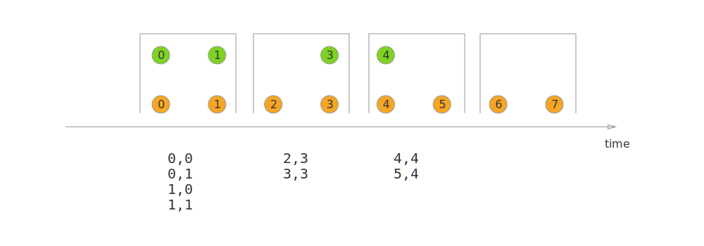
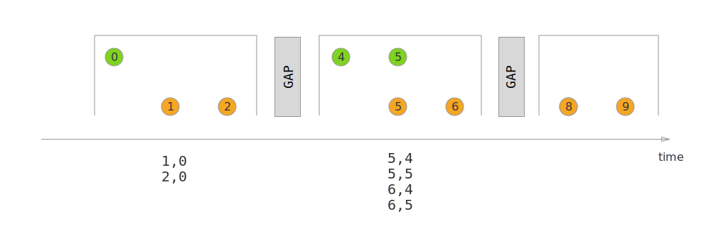

# Join

> 译者：[flink.sojb.cn](https://flink.sojb.cn/)


# 窗口关联

> 译者：[flink.sojb.cn](https://flink.sojb.cn/)


窗口连接连接两个共享公共Keys并位于同一窗口中的流的数据元。可以使用[窗口分配器](https://flink.sojb.cn/dev/stream/operators/windows.html#window-assigners)定义这些窗口，并对来自两个流的数据元进行评估。

然后将来自双方的数据元传递给用户定义的，`JoinFunction`或者`FlatJoinFunction`用户可以发出满足连接条件的结果。

一般用法可概括如下：


```
stream.join(otherStream)
    .where(<KeySelector>)
    .equalTo(<KeySelector>)
    .window(<WindowAssigner>)
    .apply(<JoinFunction>)
```


关于语义的一些注释：

*   两个流的数据元的成对组合的创建表现得像内部连接，意味着如果它们没有来自要连接的另一个流的对应数据元，则不会发出来自一个流的数据元。
*   那些关联的数据元将在其时间戳中包含仍位于相应窗口中的最大时间戳。例如，`[5, 10)`具有其边界的窗口将导致连接的数据元具有9作为其时间戳。

在下一节中，我们将使用一些示例性场景概述不同类型的窗口连接的行为。

## 翻滚窗口关联

当执行翻滚窗口连接时，具有公共Keys和公共翻滚窗口的所有数据元以成对组合的形式连接并传递给`JoinFunction`或`FlatJoinFunction`。因为它的行为类似于内连接，所以不会发出一个流的数据元，这些数据元在其翻滚窗口中没有来自另一个流的数据元！



如图所示，我们定义了一个大小为2毫秒的翻滚窗口，这导致了窗体的窗口`[0,1], [2,3], ...`。镜像显示了每个窗口中所有数据元的成对组合，这些数据元将被传递给`JoinFunction`。请注意，在翻滚窗口中`[6,7]`没有任何东西被发射，因为绿色流中不存在与橙色数据元⑥和⑦连接的数据元。

*   [**Java**](#tab_java_0)
*   [**Scala**](#tab_scala_0)


```
import org.apache.flink.api.java.functions.KeySelector;
import org.apache.flink.streaming.api.windowing.assigners.TumblingEventTimeWindows;
import org.apache.flink.streaming.api.windowing.time.Time;

...

DataStream<Integer> orangeStream = ...
DataStream<Integer> greenStream = ...

orangeStream.join(greenStream)
    .where(<KeySelector>)
    .equalTo(<KeySelector>)
    .window(TumblingEventTimeWindows.of(Time.seconds(2)))
    .apply (new JoinFunction<Integer, Integer, String> (){
        @Override
        public String join(Integer first, Integer second) {
            return first + "," + second;
        }
    });
```


```
import org.apache.flink.streaming.api.windowing.assigners.SlidingEventTimeWindows;
import org.apache.flink.streaming.api.windowing.time.Time;

...

val orangeStream: DataStream[Integer] = ...
val greenStream: DataStream[Integer] = ...

orangeStream.join(greenStream)
    .where(elem => /* select key */)
    .equalTo(elem => /* select key */)
    .window(TumblingEventTimeWindows.of(Time.milliseconds(2)))
    .apply { (e1, e2) => e1 + "," + e2 }
```


## 滑动窗口关联

执行滑动窗口连接时，具有公共键和公共滑动窗口的所有数据元都是成对组合并传递给`JoinFunction`或`FlatJoinFunction`。不会释放当前滑动窗口中没有来自其他流的数据元的一个流的数据元！请注意，某些数据元可能在一个滑动窗口中连接而在另一个滑动窗口中不连


在这个例子中，我们使用大小为2毫秒的滑动窗口并将它们滑动一毫秒，从而产生滑动窗口`[-1, 0],[0,1],[1,2],[2,3], …`。x轴下方的连接数据元是传递给`JoinFunction`每个滑动窗口的数据元。在这里，您还可以看到橙色②如何与窗口中的绿色③ `[2,3]`连接，但未与窗口中的任何内容连接`[1,2]`。

*   [**Java**](#tab_java_1)
*   [**Scala**](#tab_scala_1)


```
import org.apache.flink.api.java.functions.KeySelector;
import org.apache.flink.streaming.api.windowing.assigners.SlidingEventTimeWindows;
import org.apache.flink.streaming.api.windowing.time.Time;

...

DataStream<Integer> orangeStream = ...
DataStream<Integer> greenStream = ...

orangeStream.join(greenStream)
    .where(<KeySelector>)
    .equalTo(<KeySelector>)
    .window(SlidingEventTimeWindows.of(Time.milliseconds(2) /* size */, Time.milliseconds(1) /* slide */))
    .apply (new JoinFunction<Integer, Integer, String> (){
        @Override
        public String join(Integer first, Integer second) {
            return first + "," + second;
        }
    });
```


```
import org.apache.flink.streaming.api.windowing.assigners.SlidingEventTimeWindows;
import org.apache.flink.streaming.api.windowing.time.Time;

...

val orangeStream: DataStream[Integer] = ...
val greenStream: DataStream[Integer] = ...

orangeStream.join(greenStream)
    .where(elem => /* select key */)
    .equalTo(elem => /* select key */)
    .window(SlidingEventTimeWindows.of(Time.milliseconds(2) /* size */, Time.milliseconds(1) /* slide */))
    .apply { (e1, e2) => e1 + "," + e2 }
```


## 会话窗口关联

在执行会话窗口连接时，具有相同键的所有数据元在_“组合”_满足会话条件时以成对组合方式连接并传递给`JoinFunction`或`FlatJoinFunction`。再次执行内连接，因此如果有一个会话窗口只包含来自一个流的数据元，则不会发出任何输出！



这里我们定义一个会话窗口连接，其中每个会话除以至少1ms的间隙。有三个会话，在前两个会话中，两个流的连接数据元都传递给`JoinFunction`。在第三阶段，绿色流中没有数据元，所以⑧和⑨没有连接！

*   [**Java**](#tab_java_2)
*   [**Scala**](#tab_scala_2)


```
import org.apache.flink.api.java.functions.KeySelector;
import org.apache.flink.streaming.api.windowing.assigners.EventTimeSessionWindows;
import org.apache.flink.streaming.api.windowing.time.Time;

...

DataStream<Integer> orangeStream = ...
DataStream<Integer> greenStream = ...

orangeStream.join(greenStream)
    .where(<KeySelector>)
    .equalTo(<KeySelector>)
    .window(EventTimeSessionWindows.withGap(Time.milliseconds(1)))
    .apply (new JoinFunction<Integer, Integer, String> (){
        @Override
        public String join(Integer first, Integer second) {
            return first + "," + second;
        }
    });
```


```
import org.apache.flink.streaming.api.windowing.assigners.EventTimeSessionWindows;
import org.apache.flink.streaming.api.windowing.time.Time;

...

val orangeStream: DataStream[Integer] = ...
val greenStream: DataStream[Integer] = ...

orangeStream.join(greenStream)
    .where(elem => /* select key */)
    .equalTo(elem => /* select key */)
    .window(EventTimeSessionWindows.withGap(Time.milliseconds(1)))
    .apply { (e1, e2) => e1 + "," + e2 }
```


# 间隔关联

> 译者：[flink.sojb.cn](https://flink.sojb.cn/)


区间连接使用公共Keys连接两个流的数据元（我们现在将它们称为A和B），并且流B的数据元具有时间戳，该时间戳位于流A中数据元的时间戳的相对时间间隔中。

这也可以更正式地表达为 `b.timestamp ∈ [a.timestamp + lowerBound; a.timestamp + upperBound]`或 `a.timestamp + lowerBound &lt;= b.timestamp &lt;= a.timestamp + upperBound`

其中a和b是共享公共Keys的A和B的数据元。只要下限总是小于或等于上限，下限和上限都可以是负数或上限。间隔连接当前仅执行内连接。

当一对数据元传递给`ProcessJoinFunction`它们时，它们将被赋予`ProcessJoinFunction.Context`两个数据元的更大的时间戳（可以通过它访问）。

注意间隔连接当前仅支持事件时间。


在上面的例子中，我们连接两个流'orange'和'green'，下限为-2毫秒，上限为+1毫秒。缺省情况下，这些界限是包容性的，但`.lowerBoundExclusive()`并`.upperBoundExclusive`可以应用到改变行为。

再次使用更正式的表示法，这将转化为

`orangeElem.ts + lowerBound &lt;= greenElem.ts &lt;= orangeElem.ts + upperBound`

如三角形所示。

*   [**Java**](#tab_java_3)
*   [**Scala**](#tab_scala_3)


```
import org.apache.flink.api.java.functions.KeySelector;
import org.apache.flink.streaming.api.functions.co.ProcessJoinFunction;
import org.apache.flink.streaming.api.windowing.time.Time;

...

DataStream<Integer> orangeStream = ...
DataStream<Integer> greenStream = ...

orangeStream
    .keyBy(<KeySelector>)
    .intervalJoin(greenStream.keyBy(<KeySelector>))
    .between(Time.milliseconds(-2), Time.milliseconds(1))
    .process (new ProcessJoinFunction<Integer, Integer, String(){

        @Override
        public void processElement(Integer left, Integer right, Context ctx, Collector<String> out) {
            out.collect(first + "," + second);
        }
    });
```


```
import org.apache.flink.streaming.api.functions.co.ProcessJoinFunction;
import org.apache.flink.streaming.api.windowing.time.Time;

...

val orangeStream: DataStream[Integer] = ...
val greenStream: DataStream[Integer] = ...

orangeStream
    .keyBy(elem => /* select key */)
    .intervalJoin(greenStream.keyBy(elem => /* select key */))
    .between(Time.milliseconds(-2), Time.milliseconds(1))
    .process(new ProcessJoinFunction[Integer, Integer, String] {
        override def processElement(left: Integer, right: Integer, ctx: ProcessJoinFunction[Integer, Integer, String]#Context, out: Collector[String]): Unit = {
         out.collect(left + "," + right);
        }
      });
    });
```


