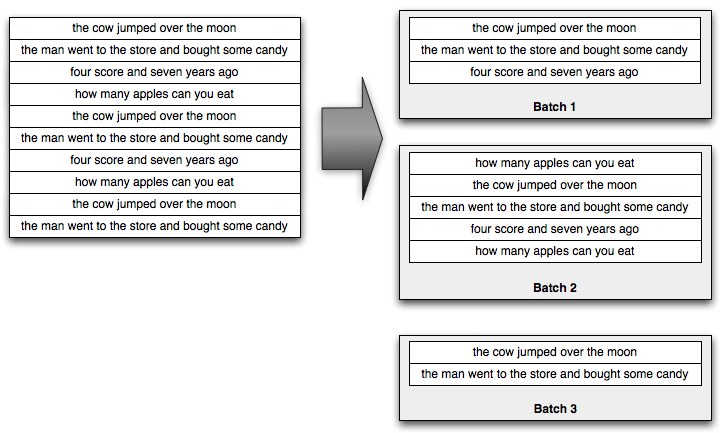
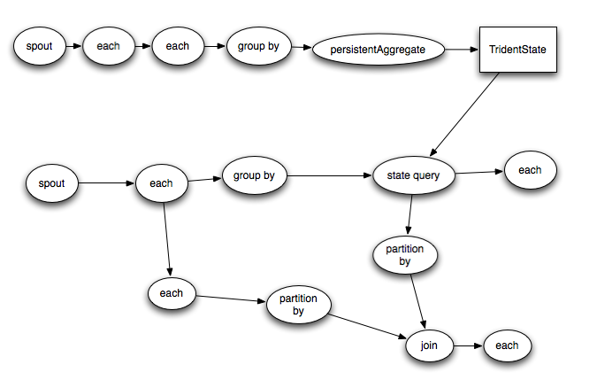
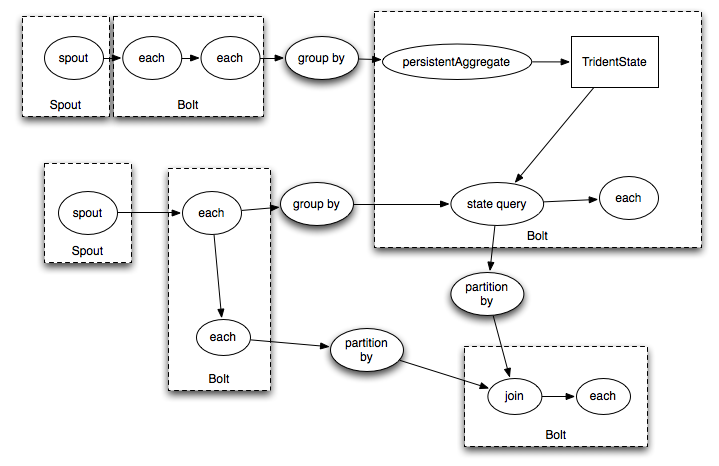

# Trident 教程

Trident 是在 Storm 基础上, 一个以实时计算为目标的 high-level abstraction （高度抽象）. 它在提供处理大吞吐量数据能力（每秒百万次消息）的同时, 也提供了低延时分布式查询和 stateful stream processing （有状态流式处理）的能力. 如果你对 Pig 和 Cascading 这种高级批处理工具很了解的话, 那么应该很容易理解 Trident , 因为他们之间很多的概念和思想都是类似的. Trident 提供了 joins , aggregations, grouping, functions, 以及 filters 等能力. 除此之外, Trident 还提供了一些专门的 primitives （原语）, 从而在基于数据库或者其他存储的前提下来应付有状态的递增式处理. Trident 也提供一致性（consistent）、有且仅有一次（exactly-once）等语义, 这使得我们在使用 trident toplogy 时变得容易.

## 举例说明

让我们一起来看一个 Trident 的例子. 在这个例子中, 我们主要做了两件事情:

1.  从一个 input stream 中读取语句并计算每个单词的个数
2.  提供查询给定单词列表中每个单词当前总数的功能

为了说明的目的, 本例将从如下这样一个无限的输入流中读取语句作为输入:

```
FixedBatchSpout spout = new FixedBatchSpout(new Fields("sentence"), 3,
               new Values("the cow jumped over the moon"),
               new Values("the man went to the store and bought some candy"),
               new Values("four score and seven years ago"),
               new Values("how many apples can you eat"));
spout.setCycle(true); 
```

这个 spout 会循环 sentences 数据集，不断输出 sentence stream , 下面的代码会以这个 stream 作为输入并计算每个单词的个数

```
TridentTopology topology = new TridentTopology();        
TridentState wordCounts =
     topology.newStream("spout1", spout)
       .each(new Fields("sentence"), new Split(), new Fields("word"))
       .groupBy(new Fields("word"))
       .persistentAggregate(new MemoryMapState.Factory(), new Count(), new Fields("count"))                
       .parallelismHint(6); 
```

在这段代码中, 我们首先创建了一个 TridentTopology 对象, 该对象提供了相应的接口去 constructing Trident computations （构造 Trident 计算过程）. TridentTopology 类中的 newStream 方法从 input source （输入源）中读取数据, 并在 topology 中创建一个新的数据流. 在这个例子中, 我们使用了上面定义的 FixedBatchSpout 对象作为 input source （输入源）. Input sources （输入数据源）同样也可以是如 Kestrel 或者 Kafka 这样的队列代理. Trident 会在 Zookeeper 中保存每个 input source（输入源）一小部分 state 信息（关于它已经消费的数据的 metadata 信息）来追踪数据的处理情况, "spout1" 字符串指定 Trident 应保留 metadata 信息到 Zookeeper 的哪个节点.

Trident 在处理输入 stream 的时候会转换成 batch （包含若干个 tuple ）来处理. 比如说, 输入的 sentence stream 可能会被拆分成如下的 batch :



一般来说, 这些小的 batch 中的 tuple 可能会在数千或者数百万这样的数量级, 这完全取决于你的 incoming throughput （输入的吞吐量）.

Trident 提供了一系列非常成熟的批处理 API 来处理这些小 batches . 这些 API 和你在 Pig 或者 Cascading 中看到的非常类似, 你可以做 groupby, join, aggregation, 执行 function 和 filter 等等. 当然, 独立的处理每个小的 batch 并不是非常有趣的事情, 所以 Trident 提供了功能来实现 batch 之间的聚合，并可以将这些聚合的结果存储到内存,Memcached, Cassandra 或者是一些其他的存储中. 同时, Trident 还提供了非常好的功能来查询这些数据源的实时状态, 这些实时状态可以被 Trident 更新, 同时这些状态也可以是一个 independent source of state （独立的状态源）.

回到我们的这个例子中来, spout 输出了一包含单一字段 "sentence" stream . 在下一行, topology 使用了 Split 函数将 stream 拆分成一个个 tuple , Split 函数读取 stream （输入流）中的 "sentence" 字段并将其拆分成若干个 word tuple . 每一个 sentence tuple 可能会被转换成多个 word tuple, 比如说 "the cow jumped over the moon" 会被转换成 6 个 "word" tuples. 下面是 Split 的定义:

```
public class Split extends BaseFunction {
   public void execute(TridentTuple tuple, TridentCollector collector) {
       String sentence = tuple.getString(0);
       for(String word: sentence.split(" ")) {
           collector.emit(new Values(word));                
       }
   }
} 
```

如你所见, 真的很简单. 它只是简单的根据空格拆分 sentence , 并将拆分出的每个单词作为一个 tuple 输出.

topology 计算完成后，会将计算结果持久化保存. 首先, word stream被根据 "word" 字段进行 group 操作, 然后每一个 group 使用 Count 聚合器进行持久化聚合. persistentAggregate 方法会帮助你把一个聚合的结果保存或者更新到状态源中. 在这个例子中, 单词的计数结果保存在内存中, 不过我们可以很简单的把结果保存到其他的存储类型中, 如 Memcached, Cassandra 等持久化存储. 如果我们要把结果存储到 Memcached 中, 只是简单的使用下面这句话替换掉 persistentAggregate 这一行就可以（使用 [trident-memcached](https://github.com/nathanmarz/trident-memcached) ）, 这当中的 "serverLocations" 是 Memcached cluster 的 host/ports （主机和端口号）列表:

```
.persistentAggregate(MemcachedState.transactional(serverLocations), new Count(), new Fields("count"))        
MemcachedState.transactional() 
```

persistentAggregate 存储的数据就是 stream 输出的所有 batches 聚合的结果.

Trident 非常酷的一点就是它提供 fully fault-tolerant （完整的容错性）, exactly-once （处理一次且仅一次）的语义. 这就让你可以很轻松的使用 Trident 来进行实时数据处理. Trident 会把状态以某种形式持久化, 以至于错误发生时 retries is necessary， 但是Trident 不会对相同的源数据多次 update 数据库.

persistentAggregate 方法会把数据流转换成一个 TridentState 对象. 在这个例子当中, TridentState 对象代表了所有的单词计数结果. 我们会使用这个 TridentState 对象来实现在计算过程中的分布式查询部分.

上面的是 topology 中的第一部分, topology 的第二部分实现了一个低延时的单词数量的分布式查询. 这个查询以一个用空格分割的单词列表为输入, 并返回这些单词的总个数. 这些查询就像普通的 RPC 调用那样被执行的, 要说不同的话, 那就是他们在后台是并行执行的. 下面是执行查询的一个例子:

```
DRPCClient client = new DRPCClient("drpc.server.location", 3772);
System.out.println(client.execute("words", "cat dog the man");
// prints the JSON-encoded result, e.g.: "[[5078]]" 
```

如你所见, 除了在 storm cluster 上并行执行之外, 这个查询看上去就是一个普通的 RPC 调用. 这样的简单查询的延时通常在 10 毫秒左右. 当然, 更复杂的 DRPC 调用可能会占用更长的时间, 但是延时很大程度上是取决于你给计算分配了多少资源.

Topology 中的分布式查询部分实现如下所示:

```
topology.newDRPCStream("words")
       .each(new Fields("args"), new Split(), new Fields("word"))
       .groupBy(new Fields("word"))
       .stateQuery(wordCounts, new Fields("word"), new MapGet(), new Fields("count"))
       .each(new Fields("count"), new FilterNull())
       .aggregate(new Fields("count"), new Sum(), new Fields("sum")); 
```

我们仍然是使用 TridentTopology 对象来创建 DRPC stream , 并且我们将这个函数命名为 "words" . 这个函数名会作为第一个参数在使用 DRPC Client 来执行查询的时候用到.

每个 DRPC 请求会被当做处理 little batch 的 job， 这个 job 输入一个代表请求的单一 tuple. 这个 tuple 包含了一个叫做 "args" 的字段, 在这个字段中保存了客户端提供的查询参数. 在这个例子中, 这个参数是一个以空格分割的单词列表.

首先, 我们使用 Split 函数把传入的请求参数拆分成独立的单词. 然后按照 word 对 stream 进行 group 操作, 之后就可以使用 stateQuery 操作查询 topology 在第一部分生成的 TridentState对象. stateQuery 接受一个 source of state （state 源）（在这个例子中, 就是我们的 topology 所计算的单词的个数的结果）以及一个用于查询的函数作为输入. 在这个例子中, 我们使用了 MapGet 函数来获取每个单词的出现个数. 由于 DRPC stream 是使用跟 TridentState 完全同样的 group 方式（按照 "word" 字段进行 group by ）, 每个单词的查询会被路由到 TridentState 对象的分区，TridentState 对象是用来管理和更新 word 计数结果的.

接下来, 我们用 FilterNull 这个过滤器将没有 count 结果的 words 过滤掉, 并使用 Sum 这个聚合器将这些 count 累加起来得到结果. 最终, Trident 会自动把这个结果发送回等待的客户端.

Trident 在如何最大程度地保证执行 topology（拓扑） 性能方面是非常智能的. 在 topology 中会自动的发生两件非常有意思的事情:

1.  读取和写入状态的操作 (比如说 stateQuery 和 persistentAggregate ) 会自动地批量处理到该状态. 如果当前处理的 batch 中有 20 次 updates 需要被同步到存储中.Trident 会自动的把这些操作汇总到一起, 只做一次读和一次写（在许多情况下, 您可以在 State implementation 中使用缓存来减少读请求）, 而不是进行 20 次读 20 次写的操作. 因此你可以在很方便的执行计算的同时, 保证了非常好的性能.
2.  Trident 的聚合器已经是被优化的非常好了的. Trident 并不是简单的把一个 group 中所有的 tuples 都发送到同一个机器上面进行聚合, 而是在发送之前已经进行过一次部分的聚合. 打个比方, Count 聚合器会先在每个 partition 上面进行 count , 然后把每个分片 count 汇总到一起就得到了最终的 count . 这个技术其实就跟 MapReduce 里面的 combiner 是一个思想.

让我们再来看一下 Trident 的另外一个例子.

## Reach

这个例子是一个纯粹的 DRPC topology , 这个 topology 会计算一个给定 URL 的 reach 值, reach 值是该 URL 对应页面的推文能够 Reach （送达）的用户数量, 那么我们就把这个数量叫做这个 URL 的 reach . 要计算 reach , 你需要获取转发过这个推文的所有人, 然后找到所有该转发者的粉丝, 并将这些粉丝去重, 最后就得到了去重后的用户的数量. 如果把计算 reach 的整个过程都放在一台机器上面, 就太困难了, 因为这会需要数千次数据库调用以及千万级别数量的 tuple . 如果使用 Storm 和 Trident , 你就可以把这些计算步骤在整个 cluster 中并行进行（具体哪些步骤, 可以参考 DRPC 介绍一文, 该文有介绍过 Reach 值的计算方法）.

这个 topology 会读取两个 sources of state （state 源）: 这是两个 map 集合，一个将该 URL 映射到所有转发该推文的用户列表, 还有一个将用户映射到该用户的粉丝列表. topology 的定义如下:

```
TridentState urlToTweeters =
       topology.newStaticState(getUrlToTweetersState());
TridentState tweetersToFollowers =
       topology.newStaticState(getTweeterToFollowersState());

topology.newDRPCStream("reach")
       .stateQuery(urlToTweeters, new Fields("args"), new MapGet(), new Fields("tweeters"))
       .each(new Fields("tweeters"), new ExpandList(), new Fields("tweeter"))
       .shuffle()
       .stateQuery(tweetersToFollowers, new Fields("tweeter"), new MapGet(), new Fields("followers"))
       .parallelismHint(200)
       .each(new Fields("followers"), new ExpandList(), new Fields("follower"))
       .groupBy(new Fields("follower"))
       .aggregate(new One(), new Fields("one"))
       .parallelismHint(20)
       .aggregate(new Count(), new Fields("reach")); 
```

这个 topology 使用 newStaticState 方法创建了 TridentState 对象来代表一个外部数据库. 使用这个 TridentState 对象, 我们就可以在这个 topology 上面进行动态查询了. 和所有的 sources of state 一样, 在这些数据库上面的查找会自动被批量执行, 从而最大程度的提升效率.

这个 topology 的定义是非常简单的 – 它仅是一个 simple batch processing job （简单的批处理的作业）. 首先, 查询 urlToTweeters 数据库来得到转发过这个 URL 的用户列表. 这个查询会返回一个 tweeter 列表, 因此我们使用 ExpandList 函数来把其中的每一个 tweeter 转换成一个 tuple .

接下来, 我们来获取每个 tweeter 的 follower . 我们使用 shuffle 来把要处理的 tweeter 均匀地分配到 topology 运行的每一个 worker 中并发去处理. 然后查询 tweetersToFollowers 数据库从而的到每个转发者的 followers. 你可以看到我们为 topology 的这部分分配了很大的并行度, 这是因为这部分是整个 topology 中最耗资源的计算部分.

然后, 我们对这些粉丝进行去重和计数. 这分为如下两步:首先, 通过 "follower" 字段对流进行 "group by" 分组, 并对每个 group 执行 "One" 聚合器. "One" 聚合器对每个 group 简单的发送一个 tuple, 该 tuple 仅包含一个数字 "1". 然后, 将这些 "1" 加到一起, 得到去重后的粉丝集中的粉丝数. "One" 聚合器的定义如下:

```
public class One implements CombinerAggregator<Integer> {
   public Integer init(TridentTuple tuple) {
       return 1;
   }

   public Integer combine(Integer val1, Integer val2) {
       return 1;
   }

   public Integer zero() {
       return 1;
   }        
} 
```

这是一个 "combiner aggregator （汇总聚合器）" , 它会在传送结果到其他 worker 汇总之前进行局部汇总, 从而使性能最优. 同样, Sum 被定义成一个汇总聚合器, 在 topology 的最后部分进行全局求和是高效的.

接下来让我们一起来看看 Trident 的一些细节.

## Fields and tuples

Trident 的数据模型是 TridentTuple，它是一个 list. 在一个 topology 中, tuple 是在一系列的 operation （操作）中增量生成的. operation 一般以一组字段作为输入并输出一组 function fields （功能字段）. Operation 的输入字段经常是输入 tuple 的一个子集, 而功能字段则是 operation 的输出.

看下面这个例子. 假定你有一个叫做 "stream" 的 stream, 它包含了 "x" ,"y" 和 "z" 三个字段. 为了运行一个读取 "y" 作为输入的 MyFilter 过滤器 , 你可以这样写:

```
stream.each(new Fields("y"), new MyFilter()) 
```

假设 MyFilter 的实现是这样的:

```
public class MyFilter extends BaseFilter {
   public boolean isKeep(TridentTuple tuple) {
       return tuple.getInteger(0) < 10;
   }
} 
```

这会保留所有 "y" 字段小于 10 的 tuples . 传给 MyFilter 的 TridentTuple 输入将只包含字段 "y" . 这里需要注意的是, 当选择输入字段时, Trident 只发送 tuple 的一个子集, 这个操作是非常高效的.

让我们一起看一下 "function fields （功能字段）" 是怎样工作的. 假定你有如下这个函数:

```
public class AddAndMultiply extends BaseFunction {
   public void execute(TridentTuple tuple, TridentCollector collector) {
       int i1 = tuple.getInteger(0);
       int i2 = tuple.getInteger(1);
       collector.emit(new Values(i1 + i2, i1 * i2));
   }
} 
```

这个函数接收两个数作为输入并输出两个新的值: 这两个数的和与乘积. 假定你有一个 stream, 其中包含 "x","y" 和 "z" 三个字段. 你可以这样使用这个函数:

```
stream.each(new Fields("x", "y"), new AddAndMultiply(), new Fields("added", "multiplied")); 
```

输出的功能字段被添加到输入 tuple 后面, 因此这个时候, 每个 tuple 中将会有5个字段 "x", "y", "z", "added", 和 "multiplied". "added" 和 "multiplied" 对应于 AddAndMultiply 输出的第一和第二个字段.

另外, 我们可以使用聚合器来用输出字段来替换输入 tuple . 如果你有一个 stream 包含字段 "val1" 和 "val2", 你可以这样做:

```
stream.aggregate(new Fields("val2"), new Sum(), new Fields("sum")) 
```

输出流将会仅包含一个 tuple, 该 tuple 有一个 "sum" 字段, 这个 sum 字段就是一批 tuple 中 "val2" 字段的累积和.

但是若对 group by 之后的流进行该聚合操作, 则输出 tuple 中包含分组字段和聚合器输出的字段, 例如:

```
stream.groupBy(new Fields("val1"))
     .aggregate(new Fields("val2"), new Sum(), new Fields("sum")) 
```

这个例子中的输出包含 "val1" 字段和 "sum" 字段.

## State

在实时计算领域的一个主要问题就是怎么样来管理状态,在面对错误和重试的时候，更新是幂等的. 消除错误的是不可能的, 当一个节点死掉, 或者一些其他的问题出现时, 这些 batch 需要被重新处理. 问题是-你怎样做状态更新（无论是外部数据库还是 topology 内部的 State）来保证每一个消息被处理且只被处理一次？

这是一个很棘手的问题, 我们可以用接下来的例子进一步说明. 假定你在做一个你的 stream 的计数聚合, 并且你想要存储运行时的 count 到一个数据库中去. 如果你只是存储这个 count 到数据库中, 并且想要进行一次更新, 我们是没有办法知道同样的状态是不是以前已经被update过了的. 这次更新可能在之前就尝试过, 并且已经成功的更新到了数据库中, 不过在后续的步骤中失败了. 还有可能是在上次更新数据库的过程中失败的, 这些你都不知道.

Trident 通过做下面两件事情来解决这个问题:

1.  每一个 batch 被赋予一个唯一标识 id "transaction id". 如果一个 batch 被重试, 它将会拥有和之前同样的 transaction id .
2.  State updates （状态更新）是按照 batch 的顺序进行的（强顺序）. 也就是说, batch 3 的状态更新必须等到 batch 2 的状态更新成功之后才可以进行.

有了这 2 个原则, 你就可以达到有且只有一次更新的目标. 此时, 不是只将 count 存到数据库中, 而是将 transaction id 和 count 作为原子值存到数据库中. 当更新一个 count 的时候, 需要比较数据库中 transaction id 和当前 batch 的 ransaction id . 如果相同, 就跳过这次更新. 如果不同, 就更新这个 count .

当然, 你不需要在 topology 中手动处理这些逻辑, 这些逻辑已经被封装在 State 的抽象中并自动进行. 你的 State object 也不需要自己去实现 transaction id 的跟踪操作. 如果你想了解更多的关于如何实现一个 State 以及在容错过程中的一些取舍问题, 可以参照 [这个文档](/documentation/Trident-state.html).

一个 State 可以采用任何策略来存储状态, 它可以存储到一个外部的数据库, 也可以在内存中保持状态并备份到 HDFS 中. State 并不需要永久的保持状态. 比如说, 你有一个内存版的 State 实现, 它保存最近 X 个小时的数据并丢弃老的数据. 可以把 [Memcached integration](https://github.com/nathanmarz/trident-memcached/blob/master/src/jvm/trident/memcached/MemcachedState.java) 作为例子来看看 State 的实现.

## Trident topologies 的执行

Trident 的 topology 会被编译成尽可能高效的 Storm topology . 只有在需要对数据进行 repartition （重新分配）的时候（如 groupby 或者 shuffle ）才会把 tuple 通过 network 发送出去, 如果你有一个 trident topology 如下:



它将会被编译成如下的 Storm spouts/bolts:



## 小结

Trident 使得实时计算更加优雅. 你已经看到了如何使用 Trident 的 API 来完成大吞吐量的流式计算, 状态维护, 低延时查询等等功能. Trident 让你在获取最大性能的同时, 以更自然的一种方式进行实时计算.