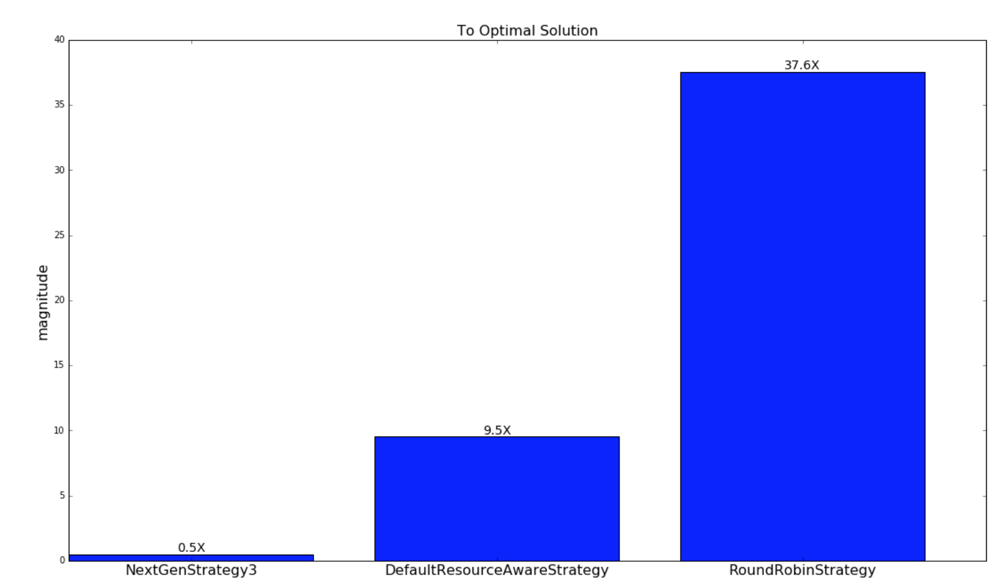
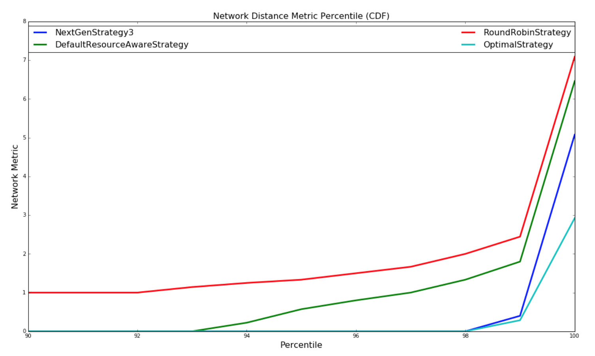
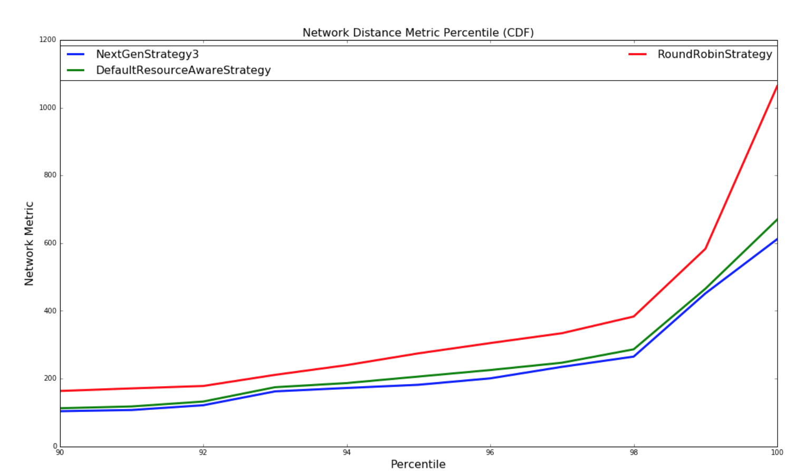
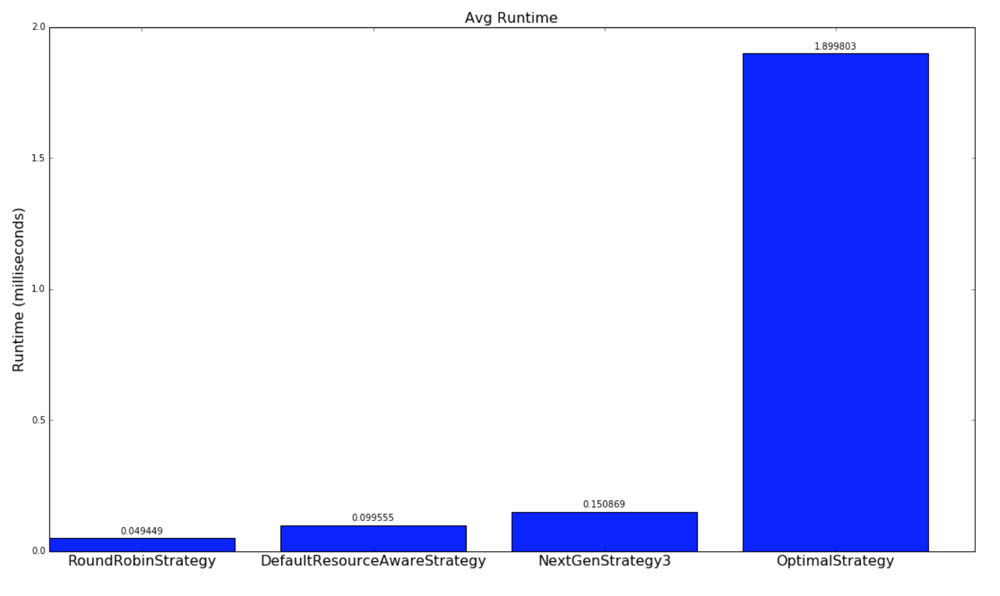
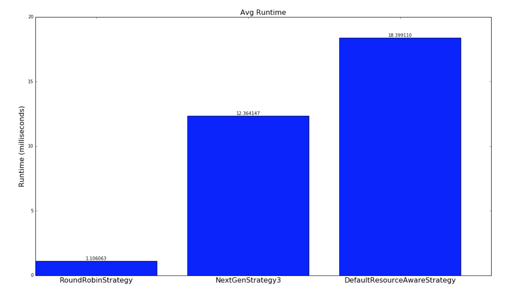

# 资源感知调度器 (Resource Aware Scheduler)

## 介绍

本文档的目的是为 Storm 分布式实时计算系统提供资源感知调度程序的描述。 本文档将为您提供 Storm 中资源感知调度程序的高级描述。 以下是 Hadoop Summit 2016 演示文稿中概述的一些好处是在 Storm 上使用资源感知调度器：

[http://www.slideshare.net/HadoopSummit/resource-aware-scheduling-in-apache-storm](http://www.slideshare.net/HadoopSummit/resource-aware-scheduling-in-apache-storm)

## Table of Contents

1.  [使用资源感知调度器](#Using-Resource-Aware-Scheduler)
2.  [API 概述](#API-Overview)
    1.  [设置内存要求](#Setting-Memory-Requirement)
    2.  [设置 CPU 要求](#Setting-CPU-Requirement)
    3.  [设置每个 worker (JVM) 进程的堆大小](#Limiting-the-Heap-Size-per-Worker-(JVM)Process)
    4.  [在节点上设置可用资源](#Setting-Available-Resources-on-Node)
    5.  [其他配置](#Other-Configurations)
3.  [Topology 优先级和每个用户资源](#Topology-Priorities-and-Per-User-Resource)
    1.  [设置](#Setup)
    2.  [指定 Topology 优先级](#Specifying-Topology-Priority)
    3.  [指定 Scheduling 策略](#Specifying-Scheduling-Strategy)
    4.  [指定 Topology 优先策勒](#Specifying-Topology-Prioritization-Strategy)
    5.  [指定 Eviction 策略](#Specifying-Eviction-Strategy)
4.  [分析资源使用情况](#Profiling-Resource-Usage)
5.  [对原始 DefaultResourceAwareStrategy 的增强](#Enhancements-on-original-DefaultResourceAwareStrategy)

## 使用资源感知调度器

用户可以通过在 _conf/storm.yaml_ 中设置以下内容来切换到使用资源感知调度器

```
storm.scheduler: “org.apache.storm.scheduler.resource.ResourceAwareScheduler” 
```

## API 概述

要使用 Trident，请参阅 [Trident RAS API](Trident-RAS-API.html)

对于 Storm Topology，用户现在可以指定运行组件的单个实例所需的 Topology 组件（即: Spout 或 Bolt）的资源量。 用户可以通过使用以下 API 调用来指定 Topology 组件的资源需求。

### 设置内存要求

API 设置组件内存要求:

```
public T setMemoryLoad(Number onHeap, Number offHeap) 
```

参数:

*   Number onHeap - 此组件的实例将以兆字节消耗的堆内存量
*   Number offHeap - 此组件的一个实例将以兆字节消耗的堆内存量

用户还必须选择只要指定堆内存要求，如果组件没有关闭堆内存需要。

```
public T setMemoryLoad(Number onHeap) 
```

参数:

*   Number onHeap - 此组件的一个实例将占用的堆内存量

如果没有为 offHeap 提供值，将使用 0.0。 如果没有为 onHeap 提供任何值，或者从未为��调用的组件 API，则将使用默认值。

使用示例:

```
SpoutDeclarer s1 = builder.setSpout("word", new TestWordSpout(), 10);
s1.setMemoryLoad(1024.0, 512.0);
builder.setBolt("exclaim1", new ExclamationBolt(), 3)
            .shuffleGrouping("word").setMemoryLoad(512.0); 
```

该 topology 结构请求的整个内存为 16.5 GB。这是从10个 spout，堆内存为 1GB，每个堆内存为0.5 GB，每个堆内存为3个 bolt 0.5 GB。

### 设置 CPU 要求

设置组件 CPU 要求的 API:

```
public T setCPULoad(Double amount) 
```

参数:

*   Number amount – 该组件实例将使用的CPU数量

目前，一个组件需要或在节点上可用的 CPU 资源量由 一个 point 系统表示。 CPU 使用是一个难以定义的概念。根据手头的任务，不同的 CPU 架构执行不同。 它们非常复杂，在单个精确的便携式数字中表达所有这些都是不可能的。 相反，我们采取了一种配置方法的惯例，主要关注 CPU 使用率的粗略水平，同时仍然提供了指定更细粒度的可能性。

按照惯例，CPU 内核通常会得到100分。如果您觉得您的处理器或多或少功能强大，您可以相应地进行调整。 CPU 绑定的重任务将获得100分，因为它们可以消耗整个内核。中等任务应该得到50，轻型任务25和小任务10。在某些情况下，您有一个任务可以产生其他线程来帮助处理。 这些任务可能需要超过100点才能表达他们正在使用的 CPU 数量。如果遵循这些约定，单个线程任务的常见情况，报告的 Capacity * 100应该是任务需要的 CPU 点数。

使用示例：

```
SpoutDeclarer s1 = builder.setSpout("word", new TestWordSpout(), 10);
s1.setCPULoad(15.0);
builder.setBolt("exclaim1", new ExclamationBolt(), 3)
            .shuffleGrouping("word").setCPULoad(10.0);
builder.setBolt("exclaim2", new HeavyBolt(), 1)
                .shuffleGrouping("exclaim1").setCPULoad(450.0); 
```

### 设置每个 worker (JVM) 进程的堆大小

```
public void setTopologyWorkerMaxHeapSize(Number size) 
```

参数:

*   Number size – worker 进程将以兆字节来分配内存范围

在每个 topology 基础上分配给单个 worker 程序的内存资源量，用户可以通过使用上述 API 来限制资源感知调度器。 该 API 已经到位，以便用户可以将 executor 传播给多个 worker。然而，将 executor 传播给多个 worker 可能会增加通信延迟，因为 executor 将无法使用 Disruptor Queue 进行进程内通信。

使用示例:

```
Config conf = new Config();
conf.setTopologyWorkerMaxHeapSize(512.0); 
```

### 在节点上设置可用资源

storm 管理员可以通过修改位于该节点的 storm home 目录中的 _conf/storm.yaml_ 文件来指定节点资源可用性。

storm 管理员可以指定一个节点有多少可用内存（兆字节），将以下内容添加到 _storm.yaml_ 中

```
supervisor.memory.capacity.mb: [amount<Double>] 
```

storm 管理员还可以指定节点有多少可用 CPU 资源，将以下内容添加到 _storm.yaml_ 中

```
supervisor.cpu.capacity: [amount<Double>] 
```

注意：用户可以为可用 CPU 指定的数量使用如前所述的点系统来表示。

使用示例:

```
supervisor.memory.capacity.mb: 20480.0
supervisor.cpu.capacity: 100.0 
```

### 其他配置

用户可以在 _conf/storm.yaml_ 中为资源意识调度程序设置一些默认配置:

```
//default value if on heap memory requirement is not specified for a component 
topology.component.resources.onheap.memory.mb: 128.0

//default value if off heap memory requirement is not specified for a component 
topology.component.resources.offheap.memory.mb: 0.0

//default value if CPU requirement is not specified for a component 
topology.component.cpu.pcore.percent: 10.0

//default value for the max heap size for a worker  
topology.worker.max.heap.size.mb: 768.0 
```

## Topology 优先级和每个用户资源

资源感知调度器或 RAS 还具有 multitenant 功能，因为许多 Storm 用户通常共享 Storm 集群。 资源感知调度器可以在每个用户的基础上分配资源。 每个用户可以保证一定数量的资源来运行他或她的 topology，并且资源感知调度器将尽可能满足这些保证。 当 Storm 群集具有额外的免费资源时，资源感知调度器将能够以公平的方式为用户分配额外的资源。topology 的重要性也可能有所不同。 topology 可用于实际生产或仅用于实验，因此资源感知调度器将在确定调度 topology 的顺序或何时驱逐 topology 时考虑 topology 的重要性。

### 设置

可以指定用户的资源保证 _conf/user-resource-pools.yaml_。以下列格式指定用户的资源保证:

```
resource.aware.scheduler.user.pools:
[UserId]
    cpu: [Amount of Guarantee CPU Resources]
    memory: [Amount of Guarantee Memory Resources] 
```

_user-resource-pools.yaml_ 可以是什么样的示例:

```
resource.aware.scheduler.user.pools:
    jerry:
        cpu: 1000
        memory: 8192.0
    derek:
        cpu: 10000.0
        memory: 32768
    bobby:
        cpu: 5000.0
        memory: 16384.0 
```

请注意，指定数量的保证 CPU 和内存可以是整数或双倍

### 指定 Topology 优先级

topology 优先级的范围可以从0-29开始。topology 优先级将被划分为可能包含一系列优先级的几个优先级。 例如，我们可以创建一个优先级映射:

```
PRODUCTION => 0 – 9
STAGING => 10 – 19
DEV => 20 – 29 
```

因此，每个优先级包含10个子优先级。用户可以使用以下 API 设置 topology 的优先级

```
conf.setTopologyPriority(int priority) 
```

参数: * priority - 表示 topology 优先级的整数

请注意，0-29范围不是硬限制。因此，用户可以设置高于29的优先级数。然而，优先级数越高的属性越低，重要性仍然保持不变

### 指定 Scheduling 策略

用户可以在每个 topology 基础上指定要使用的调度策略。 用户可以实现 IStrategy 界面，并定义新的策略来安排特定的 topology。 这个可插拔接口是因为我们实现不同的 topology 可能具有不同的调度需求而创建的。 用户可以使用 API ​​在 topology 定义中设置 topology 策略:

```
public void setTopologyStrategy(Class<? extends IStrategy> clazz) 
```

参数:

*   clazz - 实现 IStrategy 接口的策略类

使用示例:

```
conf.setTopologyStrategy(org.apache.storm.scheduler.resource.strategies.scheduling.DefaultResourceAwareStrategy.class); 
```

提供默认调度。DefaultResourceAwareStrategy 是基于 Storm 中的资源感知调度原始文件中的调度算法实现的：

Peng, Boyang, Mohammad Hosseini, Zhihao Hong, Reza Farivar, 和 Roy Campbell。"R-storm: storm 中的资源感知调度"。 在第16届年度中间件会议论文集，第149-161页。ACM，2015。

[http://dl.acm.org/citation.cfm?id=2814808](http://dl.acm.org/citation.cfm?id=2814808)

**Please Note: 必须根据本文所述的原始调度策略进行增强。请参阅"原始 DefaultResourceAwareStrategy 的增强功能"一节"**

### 指定 Topology 优先策略

调度顺序是可插拔接口，用户可以在其中定义 topology 优先级的策略。 为了使用户能够定义自己的优先级策略，他或她需要实现 ISchedulingPriorityStrategy 界面。 用户可以通过将 _Config.RESOURCE_AWARE_SCHEDULER_PRIORITY_STRATEGY_ 设置为指向实现策略的类来设置调度优先级策略。 例如:

```
resource.aware.scheduler.priority.strategy: "org.apache.storm.scheduler.resource.strategies.priority.DefaultSchedulingPriorityStrategy" 
```

将提供默认策略。以下说明默认调度优先级策略的工作原理。

**DefaultSchedulingPriorityStrategy**

调度顺序应基于用户当前资源分配与其保证分配之间的距离。我们应优先考虑远离资源保障的用户。 这个问题的难点在于，用户可能有多个资源保证，另一个用户可以拥有另一套资源保证，那么我们怎么能以公平的方式来比较呢？我们用平均百分比的资源担保作为比较方法。

例如:

| 用户 | 资源保证 | 资源分配 |
| --- | --- | --- |
| A | &lt;10 cpu,="" 50gb=""&gt; | &lt;2 40="" cpu,="" gb=""&gt; |
| B | &lt; 20 CPU, 25GB&gt; | &lt;15 10="" cpu,="" gb=""&gt; |

用户 A 的平均百分比满足资源保证:

(2/10+40/50)/2 = 0.5

用户 B 的资源保证的平均百分比满足:

(15/20+10/25)/2 = 0.575

因此，在该示例中，用户 A 具有比用户 B 满足的资源保证的平均百分比较小。因此，用户 A 应优先分配更多资源，即调度用户 A 提交的 topology。

在进行调度时，RAS 按用户资源保证和平均百分比满足资源保证的平均百分比，按用户的平均百分比满足资源保证的平均百分比排序，根据用户的顺序排序。 当用户的资源保证完全满足时，用户满足资源保证的平均百分比大于等于1。

### 指定 Eviction 策略

当集群中没有足够的可用资源来安排新的 topology 结构时，使用 eviction 策略。 如果集群已满，我们需要一种 eviction topology 的机制，以便满足用户资源保证，并且可以在用户之间公平分享其他资源。 驱逐 topology 的策略也是可插拔的界面，用户可以在其中实现自己的 topology eviction 策略。 为了使用户实现自己的 eviction 策略，他或她需要实现 IEvictionStrategy 接口并将 _Config.RESOURCE_AWARE_SCHEDULER_EVICTION_STRATEGY_ 设置为指向已实施的策略类。 例如:

```
resource.aware.scheduler.eviction.strategy: "org.apache.storm.scheduler.resource.strategies.eviction.DefaultEvictionStrategy" 
```

提供了默认的 eviction 策略。以下说明默认 topology eviction 策略的工作原理

**DefaultEvictionStrategy**

为了确定是否应该发生 topology 迁移，我们应该考虑到我们正在尝试调度 topology 的优先级，以及是否满足 topology 所有者的资源保证。

我们不应该从没有满足他或她的资源保证的用户中排除 topology。以下流程图应描述 eviction 过程的逻辑。


## 分析资源使用情况

了解 topology 的资源使用情况：

要了解 topology 结构实际使用的 memory/CPU 数量，您可以将以下内容添加到 topology 启动代码中。

```
//Log all storm metrics
conf.registerMetricsConsumer(backtype.storm.metric.LoggingMetricsConsumer.class);

//Add in per worker CPU measurement
Map<String, String> workerMetrics = new HashMap<String, String>();
workerMetrics.put("CPU", "org.apache.storm.metrics.sigar.CPUMetric");
conf.put(Config.TOPOLOGY_WORKER_METRICS, workerMetrics); 
```

CPU 指标将需要您添加

```
<dependency>
    <groupId>org.apache.storm</groupId>
    <artifactId>storm-metrics</artifactId>
    <version>1.0.0</version>
</dependency> 
```

作为 topology 依赖（1.0.0或更高版本）。

然后，您可以在 UI 上转到 topology，打开系统 metrics，并找到 LoggingMetricsConsumer 正在写入的日志。它会在日志中输出结果。

```
1454526100 node1.nodes.com:6707 -1:__system CPU {user-ms=74480, sys-ms=10780}
1454526100 node1.nodes.com:6707 -1:__system memory/nonHeap     {unusedBytes=2077536, virtualFreeBytes=-64621729, initBytes=2555904, committedBytes=66699264, maxBytes=-1, usedBytes=64621728}
1454526100 node1.nodes.com:6707 -1:__system memory/heap  {unusedBytes=573861408, virtualFreeBytes=694644256, initBytes=805306368, committedBytes=657719296, maxBytes=778502144, usedBytes=83857888} 
```

-1：__系统的度量通常是整个 worker 的 metrics 标准。 在上面的示例中，worker 正在 node1.nodes.com:6707 上运行。 这些 metrics 是每60秒收集一次。对于 CPU，您可以看到，在60秒钟内，此 worker 使用74480 + 10780 = 85260 ms 的 CPU 时间。 这相当于85260/60000或约1.5内核。

内存使用情况类似，但是查看 usedBytes。 offHeap 是 64621728 或大约 62MB，onHeap 是 83857888 或大约 80MB，但你应该知道你已经在每个 worker 中设置了你的堆。 你如何划分每个 bolt/spout？ 这有点困难，可能需要一些尝试和错误从你的结束。

## * 对原始 DefaultResourceAwareStrategy 的增强 *

如上文所述的默认资源感知调度策略有两个主要的调度阶段：

1.  任务选择 - 计算拓扑中的顺序 task/executor 应该被调度
2.  节点选择 - 给定一个 task/executor，找到一个节点来安排 task/executor。

对两个调度阶段进行了改进

### 任务选择增强

不是使用 topology 图的宽度优先遍历来创建组件及其 executor 的排序，而是使用一种新的启发式方法，可以通过组件的进出边缘数量（潜在连接）对组件进行排序。这被发现是一种更有效的方式来协调彼此通信的 executor，并减少网络延迟。

### 节点选择增强

节点选择首先选择哪个机架（服务器机架），然后选择该机架上的哪个节点。选择机架和节点的战略要点是找到具有 "最多" 资源的机架，并在该机架中使用 "最多" 免费资源查找节点。 我们为此策略制定的假设是，拥有最多资源的节点或机架将具有最高的概率，允许我们调度在节点或机架上共同定位最多的 executor，以减少网络通信延迟。

机架和节点将从最佳选择排列到最差选择。在找到执行者时，策略将在放弃之前迭代所有机架和节点，从最坏到最坏。机架和节点将按以下事项进行排序：

1.  已经在机架或节点上安排了多少个 executor -- 这样做是为了使 executor 更紧密地安排已经安排并运行的 executor。如果 topology 部分崩溃，topology 的 executor 的一部分需要重新安排，我们希望将这些 executor 尽可能接近（网络）重新安排到健康和运行的 executor。

2.  辅助资源可用性或机架或节点上的 "有效" 资源量 -- 请参阅下属资源可用性部分

3.  所有资源可用性的平均值 -- 这仅仅是可用的平均百分比（分别在机架或集群上的可用资源分配的节点或机架上的可用资源）。只有当两个对象（机架或节点）的 "有效资源" 相同时，才会使用这种情况。然后，我们将所有资源百分比的平均值作为排序指标。例如:

    ```
    Avail Resources:
    node 1: CPU = 50 Memory = 1024 Slots = 20
    node 2: CPU = 50 Memory = 8192 Slots = 40
    node 3: CPU = 1000 Memory = 0 Slots = 0

    Effective resources for nodes:
    node 1 = 50 / (50+50+1000) = 0.045 (CPU bound)
    node 2 = 50 / (50+50+1000) = 0.045 (CPU bound)
    node 3 = 0 (memory and slots are 0) 
    ```

ode1 和 节点2 具有相同的有效资源，但是明确地说，节点2具有比节点1更多的资源（memory 和 slots），并且我们将首先选择节点2，因为我们将能够安排更多的 executor。这是阶段2平均的

因此，排序遵循以下进展。 基于1）进行比较，如果相等，则基于2）进行比较，如果基于3）相等比较，并且如果相等，则通过基于比较节点或机架的 id 来通过任意分配排序来断开连接。

**下属资源可用性**

最初，RAS 的 getBestClustering 算法通过在机架中的所有节点上找到具有可用内存的最大可用总数 + 可用的最大可用机架，找到基于哪个机架具有 "最可用" 资源的 "最佳" 机架。 这种方法不是非常准确的，因为内存和 cpu 的使用不同，而且值不是正常的。 这种方法也没有效果，因为它不考虑可用的插槽的数量，并且由于资源之一（内存，CPU 或 slots）的耗尽，无法识别不可调度的机架。 以前的方法也不考虑 worker 的失败。当 topology 的 executor 未被分配并需要重新安排时，

找到 "最佳" 机架或节点的新 策略/算法，我配置从属资源可用性排序（受主导资源公平性的启发），通过下属（不占优势）资源可用性对机架和节点进行排序。

例如给出4个具有以下资源可用性的机架

```
//generate some that has alot of memory but little of cpu
rack-3 Avail [ CPU 100.0 MEM 200000.0 Slots 40 ] Total [ CPU 100.0 MEM 200000.0 Slots 40 ]
//generate some supervisors that are depleted of one resource
rack-2 Avail [ CPU 0.0 MEM 80000.0 Slots 40 ] Total [ CPU 0.0 MEM 80000.0 Slots 40 ]
//generate some that has a lot of cpu but little of memory
rack-4 Avail [ CPU 6100.0 MEM 10000.0 Slots 40 ] Total [ CPU 6100.0 MEM 10000.0 Slots 40 ]
//generate another rack of supervisors with less resources than rack-0
rack-1 Avail [ CPU 2000.0 MEM 40000.0 Slots 40 ] Total [ CPU 2000.0 MEM 40000.0 Slots 40 ]
//best rack to choose
rack-0 Avail [ CPU 4000.0 MEM 80000.0 Slots 40( ] Total [ CPU 4000.0 MEM 80000.0 Slots 40 ]
Cluster Overall Avail [ CPU 12200.0 MEM 410000.0 Slots 200 ] Total [ CPU 12200.0 MEM 410000.0 Slots 200 ] 
```

很明显，机架0是最平衡的最佳集群，可以安排最多的执行器，而机架2是机架2耗尽 cpu 资源的最差机架，因此即使有其他的可用资源

我们首先计算每个资源的所有机架的资源可用性百分比:

```
(resource available on rack) / (resource available in cluster) 
```

我们做这个计算来归一化值，否则资源值将不可比较。

所以我们的例子:

```
rack-3 Avail [ CPU 0.819672131147541% MEM 48.78048780487805% Slots 20.0% ] effective resources: 0.00819672131147541
rack-2 Avail [ 0.0% MEM 19.51219512195122% Slots 20.0% ] effective resources: 0.0
rack-4 Avail [ CPU 50.0% MEM 2.4390243902439024% Slots 20.0% ] effective resources: 0.024390243902439025
rack-1 Avail [ CPU 16.39344262295082% MEM 9.75609756097561% Slots 20.0% ] effective resources: 0.0975609756097561
rack-0 Avail [ CPU 32.78688524590164% MEM 19.51219512195122% Slots 20.0% ] effective resources: 0.1951219512195122 
```

机架的有效资源也是下属资源，计算方法如下:

```
MIN(resource availability percentage of {CPU, Memory, # of free Slots}). 
```

然后我们用有效的资源订购机架。

因此我们的例子:

```
Sorted rack: [rack-0, rack-1, rack-4, rack-3, rack-2] 
```

该 metric 用于对节点和机架进行排序。在分类机架时，我们考虑机架上和整个集群中可用的资源（包含所有机架）。在分类节点时，我们考虑节点上可用的资源和机架中可用的资源（机架中所有节点可用的所有资源的总和）

原始 Jira 为此增强: [STORM-1766](https://issues.apache.org/jira/browse/STORM-1766)

### 计划改进

本节提供了一些关于性能优势的实验结果，其中包括在原始调度策略之上的增强功能。实验基于运行模拟:

[https://github.com/jerrypeng/storm-scheduler-test-framework](https://github.com/jerrypeng/storm-scheduler-test-framework)

模拟中使用随机 topology 和集群，以及由雅虎所有 storm 集群中运行的所有真实 topology 结构组成的综合数据集。

下图提供了各种策略调度 topology 结构以最小化网络延迟的比较。 通过每个调度策略为 topology 的每个调度计算一个网络 metric。 网络 metric 是根据 topology 中的每个 executor 对驻留在同一个工作程序（JVM进程）中的另一个 executor，在不同的 worker 但是相同的主机，不同的主机，不同的机架上进行的连接进行计算的。 我们所做的假设如下:

1.  Intra-worker 之间的沟通是最快的
2.  Intra-worker 之间的沟通很快
3.  Inter-node 间通信速度较慢
4.  Inter-rack 间通信是最慢的

对于此网络 metric，数量越大，topology 结构对于此调度将具有更多的潜在网络延迟。进行两种实验。 使用随机生成的 topology 进行一组实验，并随机生成簇。 另一组实验使用包含基于 topology 大小的 yahoo 和 semi-randomly 生成的集群中的所有运行 topology 的数据集执行。两组实验都运行数百万次迭代，直到结果收敛。

对于涉及随机生成的 topology 结构的实验，实现了一种最优策略，如果存在解决方案，则会极大地找到最优解。本实验中使用的 topology 和簇相对较小，以便最优策略遍历解空间，以在合理的时间内找到最优解。 由于 topology 很大，并且运行时间不合理，所以这种策略并不适用于雅虎 topology，因为解决方案空间是 W ^ N（在工作中无关紧要），其中 W 是工作人员的数量， N 是执行者的数量。NextGenStrategy 代表具有这些增强功能的调度策略。DefaultResourceAwareStrategy 表示原始调度策略。RoundRobinStrategy 代表了一种 naive 策略，它简单地以循环方式安排执行者，同时遵守资源约束。 下图显示了网络度量的平均值。CDF 图也进一步呈现。

| Random Topologies | Yahoo topologies |
| --- | --- |
|  |  |

下一个图表显示了从各自的调度策略的调度到最优策略的调度的接近程度。如前所述，这仅适用于随机生成的 topology 和集群。

| Random Topologies |
| --- |
|  |

下图是网络 metric 的 CDF:

| Random Topologies | Yahoo topologies |
| --- | --- |
|  |  |

以下是策略运行多长时间的比较:

| Random Topologies | Yahoo topologies |
| --- | --- |
|  |  |